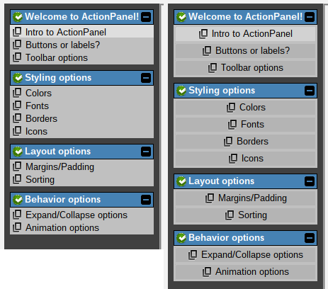
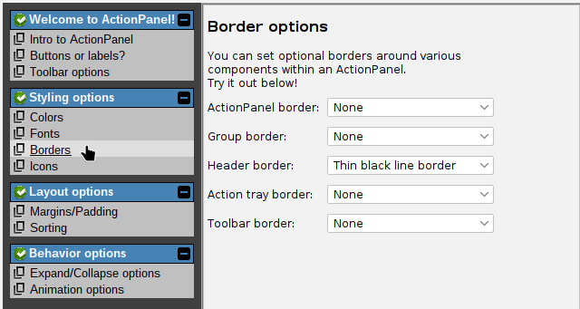

# Action type

The first option that we have is to specify how to represent each action:

- *Clickable labels*: each action is represented as a simple text label (with optional icon). When the mouse hovers over the label, it changes to a hand cursor to indicate that it's clickable. This is the default behavior if you don't specify an action type.
- *Action buttons*: each action is represented as a button (with optional icon).

Here are the two options side by side, with the same action list:



The behavior of the ActionPanel is the same in either case. The only difference is the visual representation of the actions. You can switch between these two options using the `setUseLabels()` and `setUseButtons()` methods:

```java
// Represent actions as clickable labels (the default):
actionPanel.setUseLabels();

// Represent actions as buttons:
actionPanel.setUseButtons();

// Actually, these are both shorthand for setActionComponentType():
actionPanel.setActionComponentType(ActionComponentType.LABELS);
actionPanel.setActionComponentType(ActionComponentType.BUTTONS);
```

### Highlighting the "current" action

Some ActionPanels will have the concept of a "current" action. For example, in a simple navigation menu,
where the ActionPanel is driving a content panel directly adjacent, it can be helpful to visually indicate
which action is currently active, to give the user a better sense of where they are in the application.

For example, here we have selected the "Borders" action, and we are currently viewing border options.
Note that the "Borders" action label is slightly highlighted (different background color):



This option is disabled by default, as it may not make sense for all use cases of ActionPanel.
You can enable it with the `setHighlightLastActionEnabled()` method:

```java
// Enable highlighting of the current action:
actionPanel.setHighlightLastActionEnabled(true);
```
