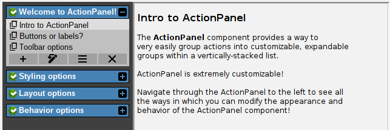

# Expand/collapse options

ActionPanels with many action groups can get difficult to navigate. For this reason, it's possible to
allow "expand/collapse" for each action group. This option is enabled by default. Here's what it looks like:



In the above example, all action groups except for the first one are collapsed, allowing the user to easily
read just the header label for each collapsed group. The expand icon on the right side of the header can be used
to expand that group. When a group is expanded, the expand icon changes to a collapse icon, which can be used to collapse the group again.

There are several options related to expand/collapse behavior:

- *Expand/collapse enabled*: you can enable or disable the expand/collapse feature for all groups. When disabled, all groups will always be expanded and the expand/collapse icon will not be shown.
- *Allow double-click header to expand/collapse*: you can allow the user to double-click the header label to trigger expand/collapse, in addition to clicking the icon. This is disabled by default.
- *Animation*: by default, an expand/collapse animation is played when the user expands or collapses a group. You can disable this animation if you prefer an instant expand/collapse effect. If enabled, you can control the animation speed and duration.

These options are presented in the `ExpandCollapseOptions` class:

```java
// Make sure all groups are expandable and collapsible:
actionPanel.getExpandCollapseOptions().setExpandable(true);

// Who doesn't like a fun animation?
actionPanel.getExpandCollapseOptions().setAnimationEnabled(true);

// Let's slow down the animation a bit (the default is 200ms):
actionPanel.getExpandCollapseOptions().setAnimationDuration(600);

// Allow double-clicking the header label to trigger expand/collapse:
actionPanel.getExpandCollapseOptions().setAllowHeaderDoubleClick(true);
```
