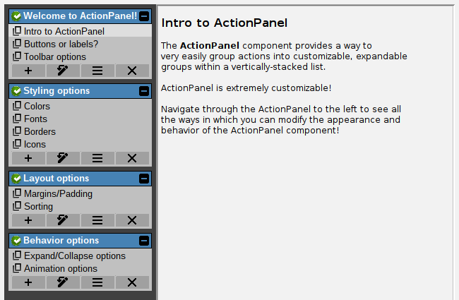

# Group toolbars

Optionally, a toolbar can be shown in each group of actions. These are icon-only buttons at the bottom
of each action group, which can either trigger a custom, caller-supplied action, or they can be one
of the built-in example actions:



The built-in example actions that can be used in the group toolbars are:

- *Rename group*: the user will be prompted with a text input dialog to enter a new name for the group. This built-in action handles duplicate prevention, such that the user won't be allowed to enter the name of an existing group (case-insensitive).
- *Edit group*: this built-in action brings up a dialog that allows the user to re-order actions within that group, or remove actions.
- *Remove group*: this built-in action removes the entire group and all of its actions from the ActionPanel.

## Enabling or disabling the built-in actions

The ToolBar is disabled by default. Additionally, there are specific permissions for each of the built-in actions. 

```java
// Enable the toolbar for all groups:
actionPanel.setToolBarEnabled(true);

// Enable our built-in actions:
actionPanel.getToolBarOptions().setAllowGroupRename(true);
actionPanel.getToolBarOptions().setAllowItemReorder(true);
actionPanel.getToolBarOptions().setAllowItemRemoval(true);
actionPanel.getToolBarOptions().setAllowGroupRemoval(true);
```

## Allowing "add new action" in the toolbar

Note that there is no built-in "add action" action. This is because ActionPanel does not know what kind of actions you want to add, or what information is required to create a new action. You can of course supply your own custom "add action" action. The `ToolBarNewItemSupplier` interface is used for this purpose. You must implement this interface and supply it to the ActionPanel. Here's an example from the built-in demo application. In this example, we simply prompt for any text string, and use that for the new action's label. Clicking that action will take the user to an example page that shows the label of the action that was clicked.

```java
// This enables "add action", but nothing will happen without a supplier!
actionPanel.getToolBarOptions().setAllowItemAdd(true);

// Let's set a new item supplier:
actionPanel.getToolBarOptions().setNewActionSupplier((a, g) -> {
    TextInputDialog dialog = new TextInputDialog(DemoApp.getInstance(), "New action");
    dialog.setAllowBlank(false);
    dialog.setInitialText("New action");
    dialog.setVisible(true);
    String actionName = dialog.getResult();
    if (actionName != null) {
      // The user provided us an action name.
      // We can create and return an Action now:
      return new CustomAction(actionName);
    }
    return null; // User cancelled, or didn't provide a name.
});
```

### Custom toolbar actions

A very similar mechanism exists for adding completely custom actions. You can implement the `ToolBarActionSupplier` interface to provide any custom action you want in the toolbar, and you can even specify conditions for when that action should be shown (for example, only show "add action" when there are fewer than 5 actions in the group, or only show "remove group" when there are more than 1 groups, etc).

```java
// Set a custom action supplier:
actionPanel.getToolBarOptions().addCustomActionSupplier((a, g) -> {
    // Here we can return any EnhancedAction suitable
    // for the ActionPanel "a" and the action group "g".
    // Our action should have an icon and a tooltip.
    return new CustomAction("Custom", someIcon).setTooltip("This is a custom action");
});
```

### Suppressing the toolbar for specific groups

Often, you may have a "special" group, whose actions relate to the ActionPanel itself, rather than to the content that the ActionPanel is navigating.
For example, you may have a control group that provides actions for creating, managing, or selecting the source of your action groups. In this case, 
you may wish to suppress the toolbar for this "special" group. You can use `addExcludedGroup()` with the case-insensitive name of the group
to exclude:

```java
// Exclude the "Control" group from having a toolbar:
actionPanel.getToolBarOptions().addExcludedGroup("Control");
```

