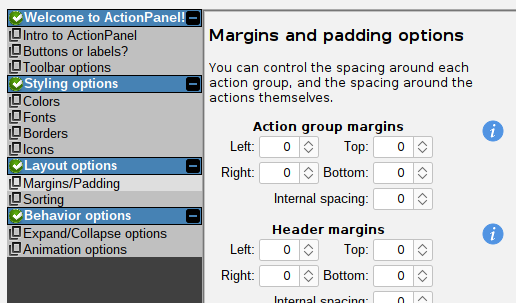
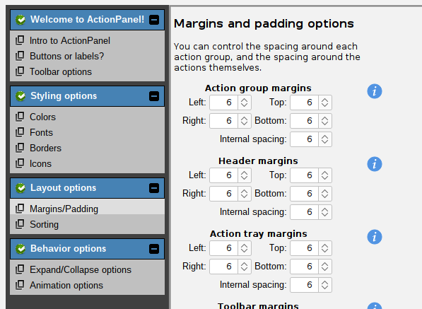
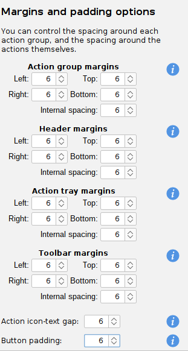

# Margins and padding

All components within an ActionPanel have a configurable margin. This allows you to "space out" components,
or tighten them up, as you wish. Here is an example of a "tight" ActionPanel, with all margins set to 0:



And now let's space things out a little bit by setting the margins to 6 pixels:



What a difference!

Here are the specific margin settings that you can configure:

- Action group margins: the margin around each action group (that is, the space between groups).
- Header margins: the margin/padding around each header label, including the gap between the icon (if present) and the text.
- Action tray margins: the margin/padding around each action label/button, including the gap between the icon (if present) and the text.
- Toolbar margins: the margin/padding around each toolbar button. Note that toolbar buttons have no text, only icons.

We can set values for the above by retrieving and modifying the `Margins` instance for each of them:

```java
// Set space to the left and right of each action group:
actionPanel.getActionGroupMargins().setLeft(4).setRight(4);

// Set space around each header label, and between the icon and text:
actionPanel.getHeaderMargins().setAll(8);
actionPanel.getHeaderMargins().setInternalSpacing(12);

// Put a gap above and below the action labels/buttons:
actionPanel.getActionTrayMargins().setTop(4).setBottom(4);

// But put the actions right next to one another:
actionPanel.getActionTrayMargins().setInternalSpacing(0);
```

And so on! Take a look at the `Margins` class, and experiment with the various settings.
The built-in demo application has an entire configuration page for this exact purpose:


