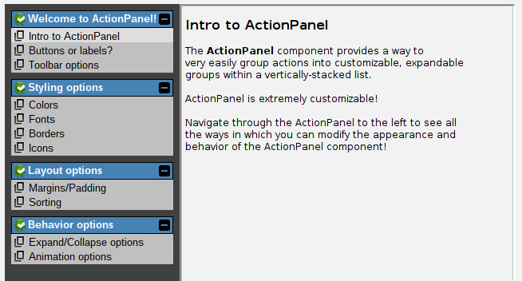

# ActionPanel

The `ActionPanel` component (new in swing-extras 2.8) is a highly-configurable navigation component that
can be used in a variety of contexts. You can present a grouped list of actions to the user, and
the user can click on an action to trigger it. 

Here is the example ActionPanel component as it appears in the built-in demo application:

Clicking any of the actions in the ActionPanel on the left will show a corresponding configuration
page in the content panel on the right. This is only one possible use for ActionPanel!

In the next few pages, we'll look at the many configuration options for ActionPanel,
and give some ideas as to how you can use it in your own applications!
