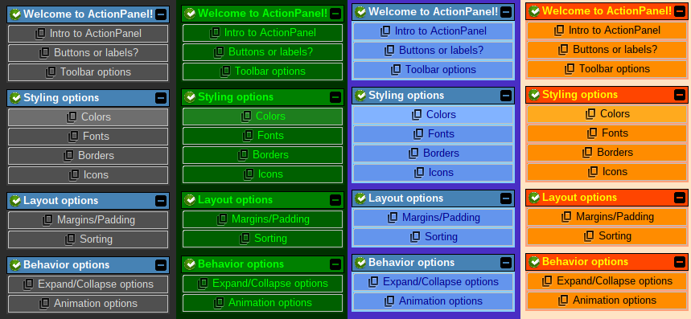

# Styling options

There are MANY cosmetic styling options for ActionPanel!

## Custom colors

By default, ActionPanel will allow the current Look and Feel to decide color options. But that's boring!
Setting custom colors is very easy, and can have a drastic effect. Here are some examples:



There are several pre-built color themes to choose from:

- ActionPanel default
- Light
- Dark
- ICE
- Matrix
- Got the blues
- Shades of gray
- Hot dog stand

Or, you can create your own custom color scheme by specifying individual colors.

### Allowing the Look and Feel to control colors

By default, ActionPanel will use the current Look and Feel to determine its colors. If you have modified
the color scheme, and need to revert back to the default Look and Feel colors, you can
use the `useSystemDefaults()` method in `ColorOptions`:

```java
// No more custom colors!
actionPanel.getColorOptions().useSystemDefaults();
```

### Using the pre-built themes

The pre-built color themes are present in an enum called `ColorTheme`. To apply one of these themes, 
simply call the `setFromTheme()` method in ColorOptions, passing in the enum value of your choice:

```java
// Set the Matrix theme (green on black):
actionPanel.getColorOptions().setFromTheme(ColorTheme.MATRIX);
```

### Setting fully-custom colors

The `ColorOptions` class provides individual setter methods that allow you to fine-tune exact color settings:

```java
public ColorOptions setPanelBackground(Color color) { ... }
public ColorOptions setActionForeground(Color color) { ... }
public ColorOptions setActionBackground(Color color) { ... }
public ColorOptions setActionButtonBackground(Color color) { ... }
public ColorOptions setGroupHeaderForeground(Color color) { ... }
public ColorOptions setGroupHeaderBackground(Color color) { ... }

// Toolbar buttons can either have a solid background color...
public ColorOptions setToolBarButtonBackground(Color color) { ... }

// Or, they can be transparent, to defer to the background behind them:
public ColorOptions setToolBarButtonsTransparent() { ... }
```

There are also getters (not shown above) to inspect the current color settings.
