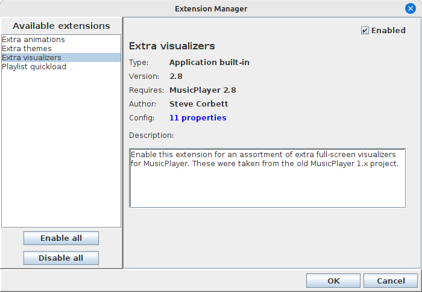

# AppProperties

## Using AppProperties to combine PropertiesManager and ExtensionManager

To make things even easier, the `app-extensions` code also includes a
wrapper class `AppProperties`, which combines a custom `ExtensionManager`
together with a `PropertiesManager` instance. This allows those two classes
to co-ordinate things like the enabled/disabled status of extensions, and makes
the client code just a little easier to manage. Basically, once our `AppProperties`
instance exists, we can invoke the `save()` and `load()` methods as needed to
load properties and extension enabled status to and from our config file.

Setting up a new `AppProperties` instance is fairly straightforward:

 ```java
 public class MyAppProps extends AppProperties<MyAppExtension> {
    public MyAppProps() {
        super("MyAmazingImageEditor", new File("mypropsfile"), MyExtensionManager.getInstance());
    }

    @Override
    protected List<AbstractProperty> createInternalProperties() {
        List<AbstractProperty> props = new ArrayList<>();

        // Load the properties that our application natively knows about:
        props.addAll(getGeneralProps());
        props.addAll(getDiskProps());

        return props;
    }
}
```

Basically, we just need to provide the location on disk where our configuration should
be saved and loaded, and then override the `createInternalProperties` method
to specify the properties that our application knows about natively.

But wait... where do we load the properties from our extensions? We had to do that
manually earlier, didn't we? It turns out the `AppProperties` class can do this for us,
because it contains both a `PropertiesManager` and an `ExtensionManager` together.
So, our application code can be simplified a bit.

There are convenience methods in `AppProperties` that make generating and showing
the properties dialog and the extension manager dialog very simple:

```java
// Show the application properties dialog:
if (myAppProps.showPropertiesDialog(MainWindow.getInstance())) {
    // User okayed the properties dialog...
    // reload our UI to reflect the new property values
}

// Show the extension manager:
if (myAppProps.showExtensionDialog(MainWindow.getInstance())) {
    // User okayed the extension manager dialog...
    // reload our UI to show/hide extension-related options
}
```

Great! Having the configuration properties managed by `PropertiesManager` and the
extension enabled/disabled status managed by `ExtensionManager` makes our code so
much easier. Combining those two classes together into a custom `AppProperties` class
makes it even easier!

## Real-world example: musicplayer

For a real-world example of `app-extensions` being used to enhance an application,
I refer you to my own [musicplayer application](https://github.com/scorbo2/musicplayer):



The extensions shown above are the "built-in" extensions that come with the musicplayer application.
These "built-in" extensions are added not dynamically loaded from jar files, but rather programmatically
added directly to the `ExtensionManager`:

```java
// Load all the built-in extensions:
addExtension(new ExtraThemes(), true);
addExtension(new ExtraAnimations(), true);
addExtension(new ExtraVisualizers(), true);
addExtension(new QuickLoadExtension(), true);
```

Supplying "built-in" extensions like this can be a great way of testing our your extension points with
actual extensions (this often reveals places where more extension points are needed), and also provides
your users with a template they can follow to write their own extensions.

We can also see lots of dynamically loaded configuration properties:


The visualizer tab that we're looking at was added by the `ExtraVisualizers` extension. Disabling this extension
results in this tab being hidden and the option for the "rolling waves" visualizer disappears from the application.

## Extensions can greatly enhance your application

There are effectively no limits to what an application designed with extensibility in mind can do.
With enough extension points, it's possible that your application could eventually be capable of doing
really cool things that you never thought of when you wrote it - and you can do often it without even
changing the application code itself!
