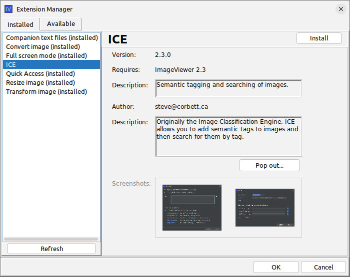
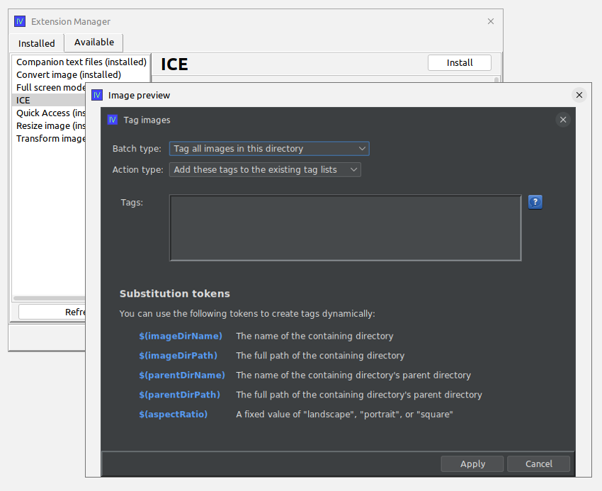
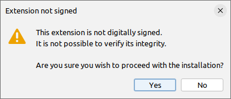
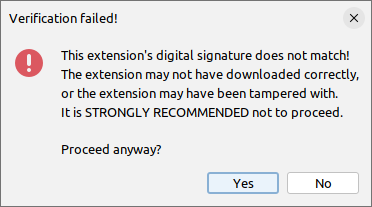
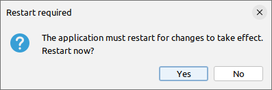
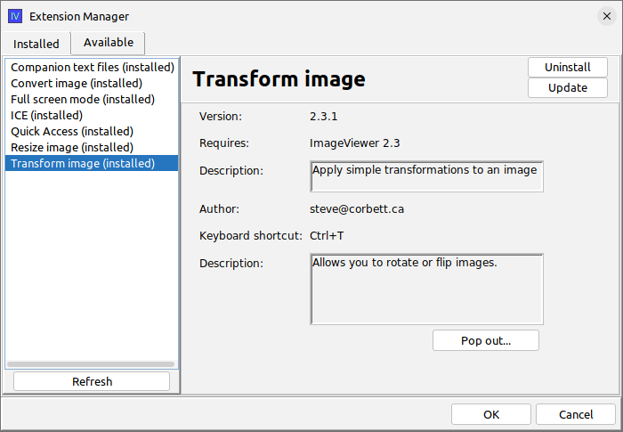

# Discovering extensions

How do users of your application find and install new extensions? How do they update existing extensions
when a new version is made available? Prior to `swing-extras` 2.5 release, this was an entirely manual
process of distributing jar files and having the user copy them into your application's extensions directory.
But now, there's a much better way!

## Dynamic extension discovery

Starting with the 2.5 release of `swing-extras`, your application can now package an `update_sources.json` file
that describes where to look for new extensions, or new versions of existing extensions. An example from
the ImageViewer application looks like this:

```json
{
  "applicationName": "ImageViewer",
  "updateSources": [
    {
      "name": "www.corbett.ca",
      "baseUrl": "http://www.corbett.ca/apps/ImageViewer",
      "versionManifest": "version_manifest.json",
      "publicKey": "public.key"
    }
  ]
}
```

This json file simply points to some web host where you have put your extension jars, along with a 
`version_manifest.json` that describes the exact versions that are available. You can also optionally
specify a public key, which the application will automatically use to verify the digital signature
of downloaded extension jars (assuming you decided to sign them - highly recommended but not mandatory).

To see what this looks like in practice, let's look at the ExtensionManagerDialog for the ImageViewer
application, but this time, let's click on the "Available" tab to download a list of extensions:



Here we can see a list of extensions that are provided by the web host that you specified in
the `update_sources.json` file. This list is dynamically retrieved, so the latest available extension
versions are shown here. In this example, we see `(installed)` beside each extension name, except
for the ICE extension (the selected one). This means that all the other extensions are already installed,
and we have the option to install the ICE extension by using the "install" button in the top right.

Note that extensions can have screenshots! Double-clicking one of the screenshots for ICE allows
us to see a screenshot of one of the dialogs provided by this extension:



So, let's say I want to install this extension. What happens when I click "install"?

## Installing new extensions automatically

Clicking "install" kicks off the following process:

1. The extension jar is downloaded
2. The extension's digital signature is downloaded (if signed)
3. The update source's public key is used to verify the signature
4. If it matches, the extension is installed and the application is restarted.

Let's look at some of those steps in detail:

### Downloading unsigned extensions

Digitally signing extension jars is not mandatory. However, it is strongly recommended, so that your
users know that the jar file downloaded correctly and that its signature matches with the public key
that you provided on your web host. If an extension is not signed, the following warning is shown:



The user is warned, but is given the option to proceed anyway. If the user declines, the downloaded
extension jar is discarded and is NOT installed.

### Signature mismatches

Rarely, a download may fail, and result in a corrupt file. Or, hopefully even more rarely, a malicious
actor may somehow upload a fake jar file to your web host. If the digital signature fails to match
against the public key, the following warning is shown:



The user is *strongly warned* about this very suspicious event, but nonetheless is still given 
the option to proceed regardless.

### Restarting the application

The application must restart in order for the extension to be activated. The following
prompt is shown:



## Updating extensions

Discovering and installing new extensions is great, but it doesn't stop there!
What if a new version of an existing extension is published? Can users upgrade from the
older version to the newer version? Yes, they can!



Let's say I'm currently using version `2.3.0` of the "Transform image" extension. When I go
to the "Available" tab of the ExtensionManagerDialog, as shown above, I notice a new
"Update" button has been added to the top right. The application has detected that
a newer version `2.3.1` of this extension exists on the remote web host, and I now have
the opportunity to update this extension.

The download process is largely the same as described early for installing extensions.
The jar file is downloaded and its digital signature is verified. If it matches, then the
old jar file is deleted and the new one is moved into place. Then, the same "restart application"
prompt will appear.

## Uninstalling extensions

Both the "Installed" tab and the "Available" tab in the ExtensionManagerDialog will offer
an "uninstall" button for each extension. Clicking this will simply remove the jar in question
and then show the application restart prompt.

Note: built-in extensions cannot be uninstalled, as they are not loaded from jar files, but rather
packaged with the application itself.

# Great, but how do I set it all up?

Is it necessary to create the `update_sources.json` and `version_manifest.json` by hand?
No! There is a very useful helper application for this exact purpose: [ExtPackager](https://github.com/scorbo2/ext-packager)

Let's look at that in the next section!
