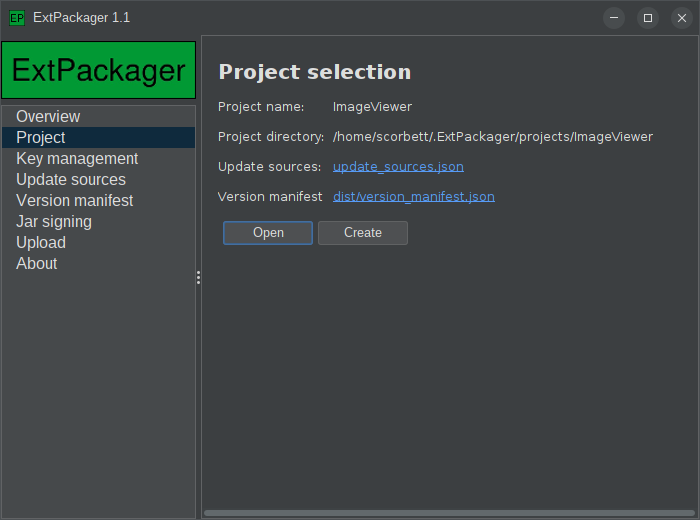
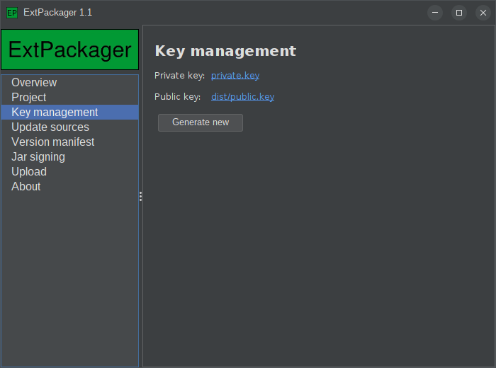
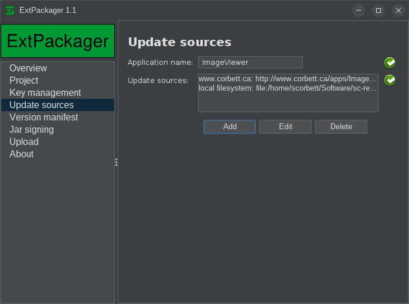
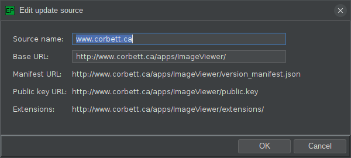
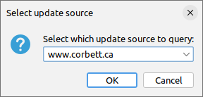
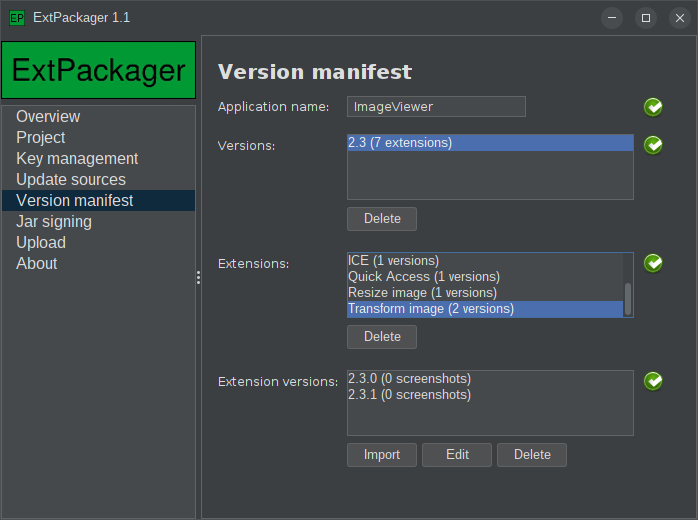
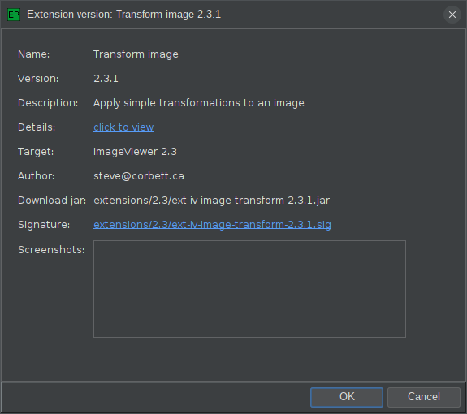
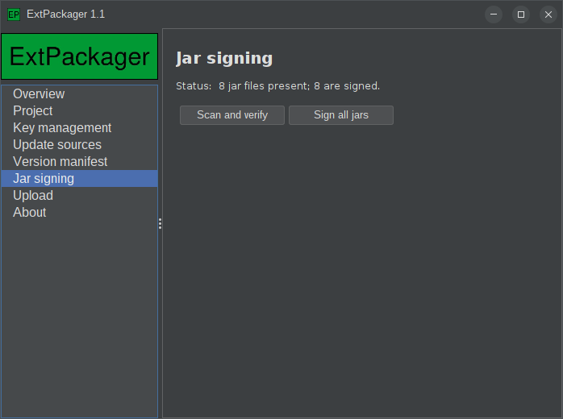
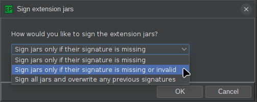
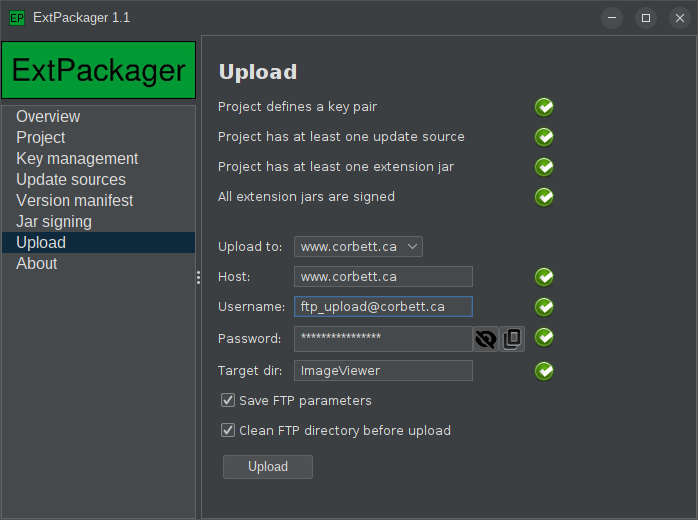

# ExtPackager



The `ExtPackager` application makes generating your json very easy. The application can walk you
through the entire process:

- Creating and naming a project
- Generating a private/public key pair for signing
- Defining the location of your remote web host
- Importing one or more extension jars to make available
- Signing your jar files
- Uploading (via FTP) the result to your web host

Let's look at these steps in detail.

## Generating a key pair



Remember that digitally signing your extension jars is optional, but strongly recommended.

Fortunately, with ExtPackager, it's as easy as clicking one button. The private key is stored
in the project directory, and the public key is stored in the distribution directory. The public
key will therefore be uploaded to your remote web host, but the private key *will not be uploaded*.
Keep it safe.

## Specifying a remote web host



Here we can specify the location of our remote web host, and the URL that the application
will hit to retrieve our version manifest and our extension jars.

Adding a remote host is fairly straightforward:



We must supply a source name (this will be shown to the user if more than one remote host is
specified, to differentiate them), and a "base URL". All download paths are relative to this
base URL. That means that all of the extension jars supplied by this remote host must live
on the same web server. 

### But what if I want to host extension jars on multiple servers?

That's actually not a problem! You can simply define multiple update sources. When the user
visits the "Available" tab of the ExtensionManagerDialog, they will be given the ability
to choose between the available update sources:



## Building the version manifest

The json for the version manifest can be very long and quite complex. Fortunately, you don't
really ever have to edit it manually. ExtPackager makes the process reasonably straightforward:



This may look complicated, but really, the most important button on this page is "Import", which
allows you to browse for your extension jar(s). Once imported, ExtPackager will build the 
version manifest, even if you have supplied multiple versions of your extension jar files.

In the screenshot above, for example, we can see that there are two available versions of the 
"Transform image" extension. When the user visits the ExtensionManagerDialog for this application,
the latest version will be detected and made available for install (or for update, if the user
has an older version installed).

You can re-visit this tab later, as you add new extensions or create new versions of existing 
extensions. Simply go through the same import process as above with the new jars, and they will
be built into the version manifest, which can then be re-uploaded to your web host.

## Adding screenshots

Double-clicking any extension version will bring up the details dialog, which contains
a screenshots field at the bottom:



You can drag images from your file system to this screenshots field, and ExtPackager will
automatically add them to the version manifest, so that users can view them in the
ExtensionManagerDialog.

## Signing jar files



Digitally signing jar files is very easy, assuming you created a key pair on the "Key management" tab first.
Simply click "Sign all jars" and the digital signatures will be generated and added to the version manifest.

If you add new extensions later, or new versions of existing extensions, you can return to this tab,
and the "Sign all jar" button will give you some options:



You have the option of either signing only jars that aren't currently signed, or forcing a re-sign of all
jars. The "resign all jars" option is also useful if you ever regenerate your key pair.

## Uploading the result



Once your jars are all signed, screenshots have been added, and your version manifest is ready to go,
you can visit the Upload tab, shown above, to upload the entire thing to your remote web host.
If FTP is not an option, or you prefer to do this manually, you can look for the "dist" subdirectory
in your ExtPackager projects location (default ~/.ExtPackager/projects), and upload all contents yourself.

Don't forget to package the `update_sources.json` file with your application! Your application needs this
to locate the version manifest and figure out what extension jars are available. 

# Wiring it all up

In your application code, you can use the optional extra parameter to `AppProperties.showExtensionDialog()` to link
up your update sources:

```java
// Load the update_sources.json file:
UpdateSources updateSources = UpdateSources.fromFile(myUpdateSourcesJsonFile);

// Create an UpdateManager to encapsulate it:
UpdateManager updateManager = new UpdateManager(updateSources);

// Give this UpdateManager to AppProperties when launching ExtensionManagerDialog:
myAppProperties.showExtensionDialog(myMainWindow, updateManager);
```

Congratulations! The "Available" tab will appear automatically on your ExtensionManagerDialog,
and your users will have the option of installing new extensions, or updating existing ones!
