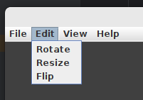

# ExtensionManager

We should take a look at the `ExtensionManager` base class and its intended purpose.
This class contains methods that can scan a directory for compatible jar files and
load them dynamically (we'll discuss what we mean by "compatible" in the next section).
Once loaded, the `ExtensionManager` is the central authority that tracks which extensions
have been loaded, and which of them are currently enabled. Extensions can be enabled
or disabled at will by the user at runtime, and this can have drastic effects on the
UI of the application in question. If an extension is disabled, the facilities that it
provided are gone. This might mean that menu options, buttons, popup menus, and
application configuration properties related to that extension have to be hidden.

The previous example of adding support for a new file format was a fairly trivial one.
Let's look at a more complex example that involves UI changes, and we'll see how
`ExtensionManager` can work together with `PropertiesManager` to provide a consistent
and logical look and feel to your applications.

## A more complex example - adding new functionality

Let's look at a more complex hypothetical scenario - we're writing an image editing
application where the user can bring up an image and do certain manipulations to it:
resize it, rotate it, mirror it, and etc. Many of these basic operations can be provided
by the application code itself. But what if we want to support the idea that an extension
could offer a brand-new image editing operation that we didn't even think of when writing
the application? Can we do it? Sure!

Let's again start by implementing the `AppExtension` interface, but this time let's
keep it vague instead of focusing on specific actions like loading an input file:

```java
public abstract class MyExtension implements AppExtension {
    
    public abstract List<AbstractAction> getImageEditActions();
} 
```

This abstract method allows an extension to return a list of `AbstractAction`
instances related to image editing. Let's again add a wrapper around this
method to our extension manager class:

```java
public class MyExtensionManager extends ExtensionManager<MyExtension> {
    
    public List<AbstractAction> getImageEditActions() {
        List<AbstractAction> allActions = new ArrayList<>();
        for (MyExtension extension : getAllLoadedExtensions()) {
            List<AbstractAction> actions = extension.getImageEditActions();
            if (actions != null && ! actions.isEmpty()) {
                allActions.addAll(actions);
            }
        }
        return allActions;
    }
}
```

With this in place, our application can offer additional functionality wherever we
are building up a list of possible image edit actions. For example, when building
our edit menu:

```java
private JMenu buildImageEditMenu() {
    JMenu menu = new JMenu("Edit");
    
    // Add the ones we know about natively:
    menu.add(new JMenuItem(imageRotateAction));
    menu.add(new JMenuItem(imageResizeAction));
    menu.add(new JMenuItem(imageFlipAction));
    
    // Now add any provided by our extensions:
    for (AbstractAction action : MyExtensionManager.getInstance().getImageEditActions()) {
        menu.add(new JMenuItem(action));
    }
}
```

When we initially release our application, there will not yet be any extensions for it,
so the menu will only show the image edit actions that shipped with the application.
But over time, as extensions are written and published, our image edit menu will automatically
expand to include them.



But what happens when one of those extension actions is invoked? What can an extension
actually do? Well, pretty much whatever you want. Let's look at extension code for
our hypothetical image editing application:

```java
public class AddImageBorderExtension extends MyExtension {
    
    @Override
    public List<AbstractAction> getImageEditActions() {
        List<AbstractAction> actionList = new ArrayList<>();
        actionList.add(new AddImageBorderAction());
        return actionList;
    }
}
```

And the code for our custom action is similarly simple:

```java
public class AddImageBorderAction extends AbstractAction {
    
    public AddImageBorderAction() {
        super("Add border...");
    }
    
    @Override
    public void actionPerformed(ActionEvent e) {
        if (MainWindow.getInstance().getSelectedImage() == null) {
            JOptionPane.showMessageDialog(MainWindow.getInstance(), "Nothing selected.");
        }
        
        new AddImageBorderDialog(MainWindow.getInstance()).setVisible(true);
    }
}
```

Our extension code can reference whatever it needs from the application codebase,
because extensions are built using that code. So, as long as our application provides
ways for extensions to query for things (like `MainWindow.getInstance()` and `getSelectedImage()`),
then they will be able to interact with those things.

So now, when we register our `AddImageBorderExtension`, our new menu item will
show up automatically, and the new image editing functionality supplied by our
extension is added to the application.

But, how do we register and load our extension?
