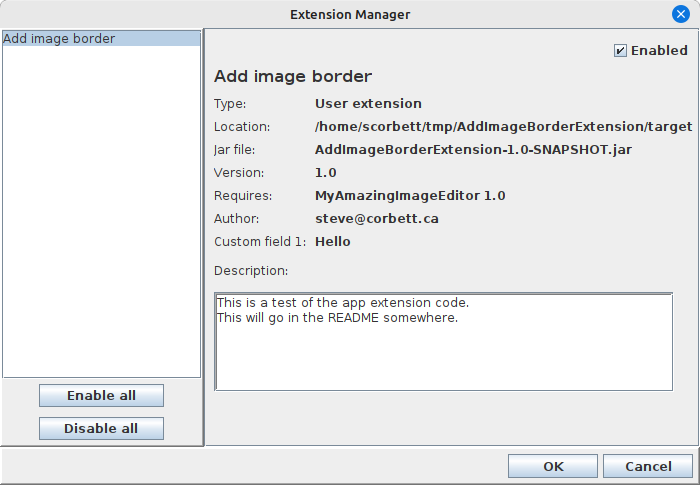
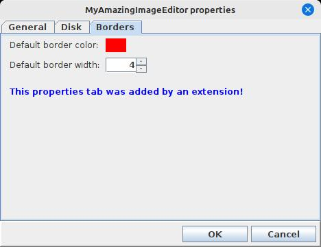

# ExtensionManagerDialog

## Managing extensions, and enabling/disabling them at runtime

Wouldn't it be nice if we could provide our users with a user-friendly view
of all loaded extensions, and maybe provide a way to enable and disable them
at runtime? Well, for that we have `ExtensionManagerDialog`!



When we launch the `ExtensionManagerDialog` from our application code, we can get
a visual listing of all currently loaded extensions and their metadata. Here,
we see not only the information that we supplied about our extension, but also the
custom field that we added to our json is also present. Here, the user has the
ability to enable or disable extensions. This requires a bit more work in our application
code! In our case, if the user disables our AddImageBorder extension, we no longer
want the menu item or the dialog to show up. So, we would have to regenerate our
main menu bar. Other applications may have to re-render their UI after every time
the `ExtensionManagerDialog` is shown, in order to show or hide controls
provided by those extensions.

The best part about `ExtensionManagerDialog` is that we don't have to write a single
line of UI code in our application - we get it for free from the `swing-extras` library!
Also, the logic for enabling/disabling extensions is wrapped up in the
`ExtensionManager` base class, so our derived class simply inherits it.

## Custom properties for extensions

What if our extension has many options, and we want to be able to expose those
options to the user in a friendly way so that they can be persisted? It turns out
that the `app-extensions` code builds on the `swing-extras` properties code, which
does a lot of this for us. We can modify our `ExtensionManager` implementation
to accommodate this. In fact, one of the methods present in the `AppExtension`
interface is `getConfigProperties`:

```java
public class AddImageBorderExtension implements MyAppExtension {
    
    @Override
    public List<AbstractProperty> getConfigProperties() {
        // ...
    }
}
```

This method gives extensions a way of returning a list of configuration properties.
You can take a look at some of the facilities in the `swing-extras` library to see
what's possible here, specifically the [PropertiesManager](../properties/PropertiesDialog.md).

Let's modify our extension to return some custom config properties:

```java
public class AddImageBorderExtension implements MyAppExtension {
    
    @Override
    public List<AbstractProperty> getConfigProperties() {
        List<AbstractProperty> props = new ArrayList<>();
        
        props.add(new ColorProperty("UI.Borders.color", "Default border color:", ColorType.SOLID, Color.RED));
        props.add(new IntegerProperty("UI.Borders.thickness", "Default border width:", 4,0,100,1));
        
        LabelProperty label = new LabelProperty("UI.Borders.label", 
                  "This properties tab was added by an extension!");
        label.setExtraMargins(12,12);
        label.setColor(Color.BLUE);
        props.add(label);
        
        return props;
    }
}
```

And in our application startup code, we can gather all of our properties
and all of our extension properties together when creating our `PropertiesManager`:

```java
private void loadConfig() {
    List<AbstractProperty> props = new ArrayList<>();
    
    // Load the properties that our application natively knows about:
    props.addAll(getGeneralProps());
    props.addAll(getDiskProps());
    
    // Also ask our ExtensionManager for any extension-supplied props:
    props.addAll(MyExtensionManager.getInstance().getAllEnabledExtensionProperties());
    
    propsManager = new PropertiesManager(PROPS_FILE, props, "MyAmazingImageEditor");
    propsManager.load();
}
```

Now, when we generate and launch the `PropertiesDialog` from our application code,
we see that our extension's properties have been added to a new tab:



And we didn't have to write any UI code at all to support this! 

## But it gets even better

Now that we've covered all the groundwork, let's look at arguably the most important class
in the whole system...
