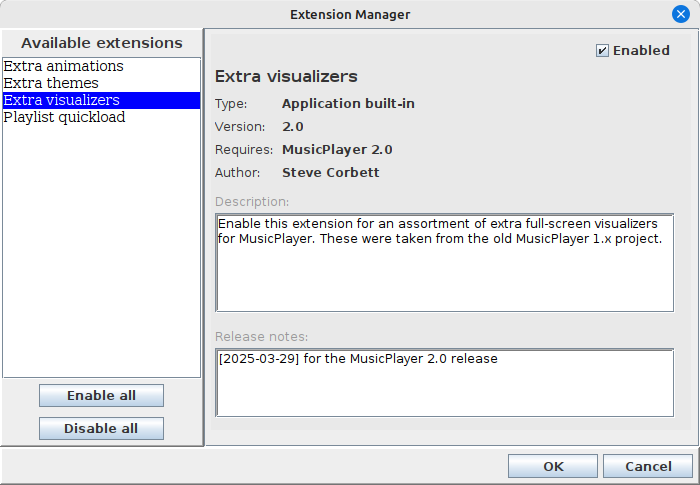
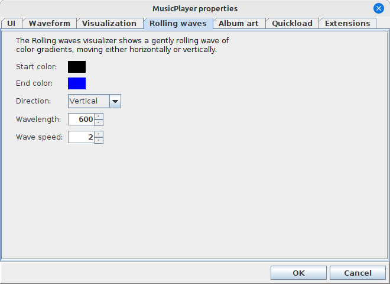

# Real-life examples

The app-extensions library is not just hypothetical code - it's been used in several applications to great effect!
Here are just a few examples of actual extensions:

## MusicPlayer

The [MusicPlayer](https://github.com/scorbo2/musicplayer) application has had extension capabilities for several
versions now. Extensions can provide additional functionality not provided by the application itself. Let's look
at the ExtensionManagerDialog presented by MusicPlayer:



We can see the four "built-in" extensions that come with the MusicPlayer application, along with
two extra extensions called "Scenery" and "Stats tracker". 

### Built-in extensions

Application can ship with some "built-in" extensions, to show what extensions can do with the application.
Unlike jar-loaded extensions, these "built-in" ones can be disabled but can't be removed. Adding extensions
programmatically is quite easy:

```java
// Load all the built-in extensions:
addExtension(new ExtraThemes(), true);
addExtension(new ExtraAnimations(), true);
addExtension(new ExtraVisualizers(), true);
addExtension(new QuickLoadExtension(), true);
```

Supplying "built-in" extensions like this can be a great way of testing our your extension points with
actual extensions (this often reveals places where more extension points are needed), and also provides
your users with a template they can follow to write their own extensions.

If we take a look at MusicPlayer's config dialog, we can see lots of dynamically loaded configuration properties:



The visualizer tab that we're looking at was added by the `ExtraVisualizers` extension. Disabling this extension
results in this tab being hidden and the option for the "rolling waves" visualizer disappears from the application.

Extensions for MusicPlayer can provide new fullscreen visualization effects to show while music is playing. 
The [Scenery extension](https://github.com/scorbo2/ext-mp-scenery) for MusicPlayer is an interesting example of this.
It shows gently scrolling landscape scenery images, with programmable "tour guides" that can appear at configured
intervals to offer commentary either on the currently playing track, or on the currently shown scenery image:


## ImageViewer

The [ImageViewer](https://github.com/scorbo2/imageviewer) application was also designed with extension in mind.
Almost all built-in functionality within the app is extensible, allowing the creation of extensions that can do
almost any kind of manipulation on the currently shown image. 

Let's look at ImageViewer's ExtensionManagerDialog:


We see there are many extensions available for this application, because it has been under development
for quite a long time. 

Here are just some of the extensions for ImageViewer:

- [Image Transform](https://github.com/scorbo2/ext-iv-image-transform) - rotate or flip an image
- [Image Resize](https://github.com/scorbo2/ext-iv-image-resize) - resize an image or a directory of images
- [Image Converter](https://github.com/scorbo2/ext-iv-image-converter) - convert an image or a directory of images between jpg and png formats
- [Full Screen](https://github.com/scorbo2/ext-iv-fullscreen) - presents a directory of images as a fullscreen slideshow
- [ICE](https://github.com/scorbo2/ext-iv-ice) - allows semantic tagging and searching of images

## It starts with extensible application design

ImageViewer is actually a good example of an application that was designed with extensibility in mind. 
Take a look in particular at the [ImageViewerExtension](https://github.com/scorbo2/imageviewer/blob/master/src/main/java/ca/corbett/imageviewer/extensions/ImageViewerExtension.java)
abstract class to see what kind of functionality is exposed to ImageViewer extensions. The
[ImageViewerExtensionManager](https://github.com/scorbo2/imageviewer/blob/master/src/main/java/ca/corbett/imageviewer/extensions/ImageViewerExtensionManager.java)
class handles interrogation of currently loaded and enabled extensions to see what features they offer.

It's difficult, but not impossible, to add extension capabilities to an application as an afterthought.
It's therefore recommended to think about possible extension points early in the application's development!
You are only limited by your own creativity! Try to think up ways that your application could be extended! 
