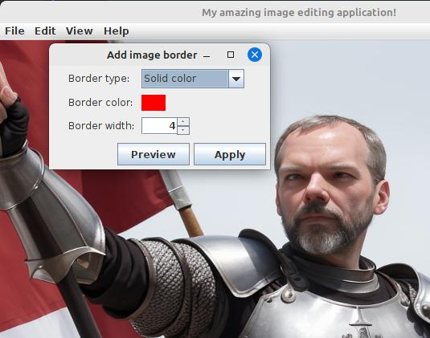

# Registering an extension

Extensions have to package up a file called `extInfo.json` in their jar file.
The file can live anywhere, but a fully-qualified package name directory structure
in the jar resources is a good convention. This file contains information about our
extension:

```json
{
  "name": "Add image border",
  "author": "steve@corbett.ca",
  "version": "1.0",
  "targetAppName": "MyAmazingImageEditor",
  "targetAppVersion": "1.0",
  "shortDescription": "Add a configurable border to selected image",
  "longDescription": "This is a test of the app extension code.\nThis will go in the README somewhere.",
  "releaseNotes": "1.0 - initial release",
  "customFields": {
    "Custom field 1": "Hello"
  }
}
```

We can specify a name and description of our extension, but more importantly,
we can specify an application name and version, which we'll use in a moment when loading
the extension. We can also specify custom fields in the form of name/value pairs of
additional information for this extension. Let's try that out just to see what happens.

Okay, so, how do we tell our application about our new extension? And how does the application
actually load them? Well, that's what the `ExtensionManager` class is for. Somewhere
in our application startup, we should ask our extension manager to load all extensions
from jars in some known location (perhaps in an "extensions" folder in our application
install directory, or by prompting the user for it):

```java
File extensionDir = new File("...some directory with extension jars...");
MyExtensionManager.getInstance().loadExtensions(extensionDir, MyAppExtension.class, "MyAmazingImageEditor", "1.0");
```

The `loadExtensions` method takes some parameters to help it find jar files that are appropriate
for this application. Specifically, we have to pass in the class of our `AppExtension`
implementation. We also provide an application name and version. This is so that extension
manager can weed out extension jars that target some other application, or extension jars
that target the wrong version of this application.

On startup, we now see that our application has registered and our menu
item appears:


And when we click this new menu item, we see our border dialog comes up:



Great! Our extension is loaded and the functionality it provides has been added to our application's
functionality, even without our application code knowing anything at all about the new function!
We can continue now to add extensions to our application this way, building it up over time until
it does many more things that it was originally designed to do.

## Your application is a framework

Heavy use of `ExtensionManager` requires you to think of your application as more of a framework.
You need to provide access to the core parts of what your application does, and add extension points
all throughout your code, so that extensions can step in as needed to augment or even replace
parts of what your application code does. If you design your application with this in mind, writing
extensions later will be much easier, and your application might grow far beyond what you
originally envisioned for it.

But, we have a slight problem - how do we know when an application extension has been enabled or
disabled? How do we know when to reload our UI?
