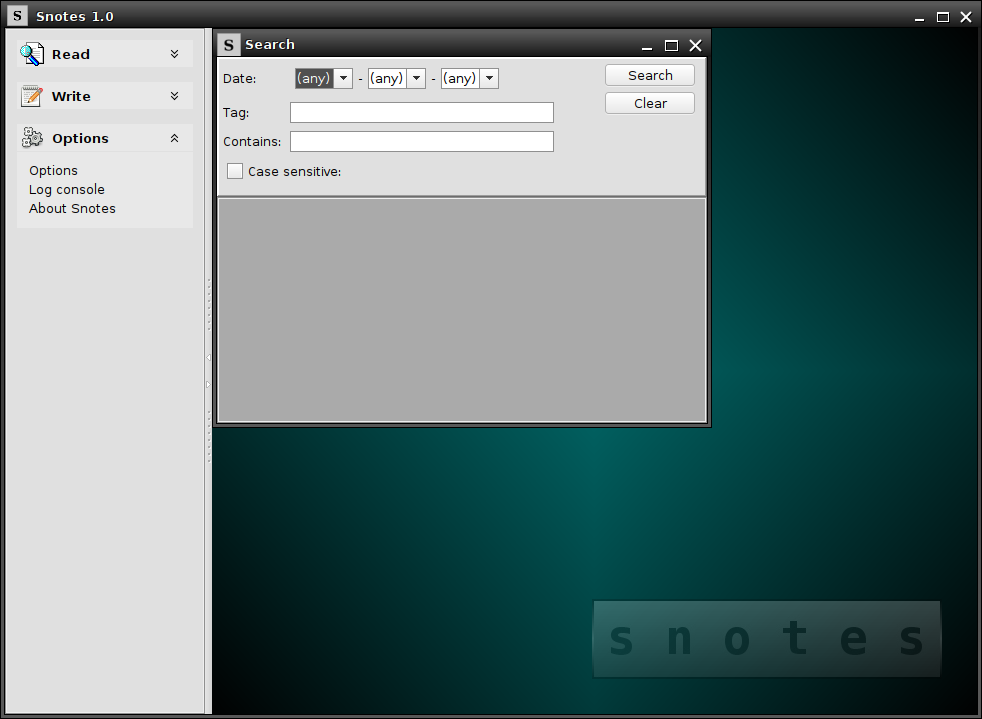
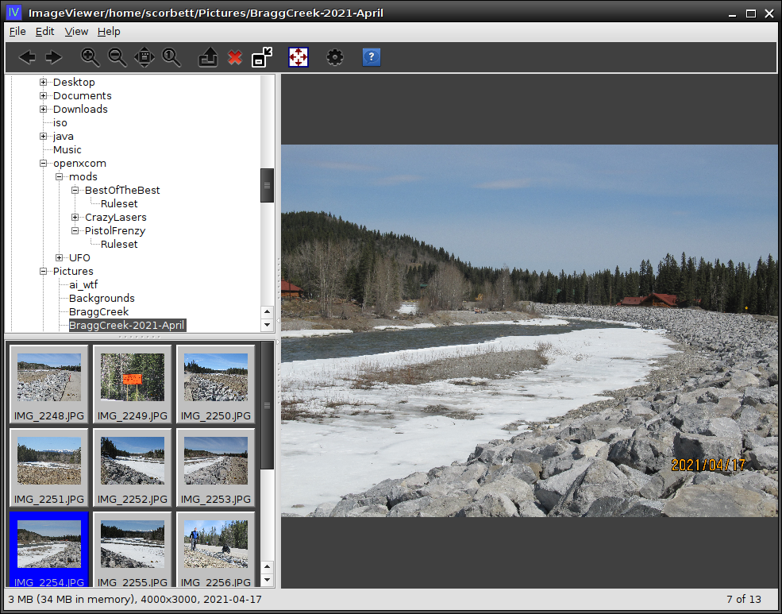
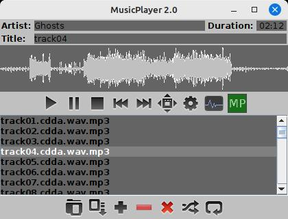
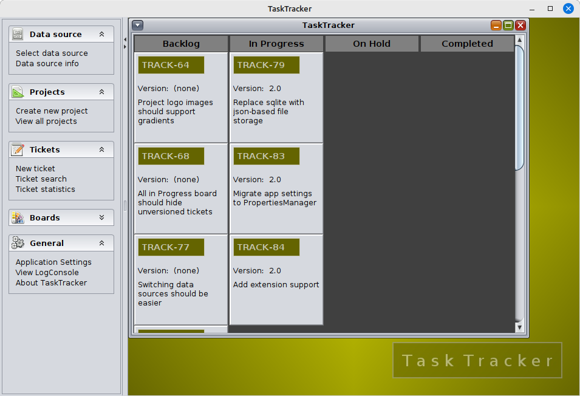

# Conclusion

In this guide, we've looked at some of the many possibilities offered by the `swing-extras` library
for your Java Swing applications. This library provides opportunities to speed up and/or simplify
your own application development efforts!

For real-world examples of usages of this library, I invite you view my
other projects, some of which are available on my GitHub page: [https://github.com/scorbo2](https://github.com/scorbo2)

## Snotes

## ImageViewer

## MusicPlayer

## TaskTracker

