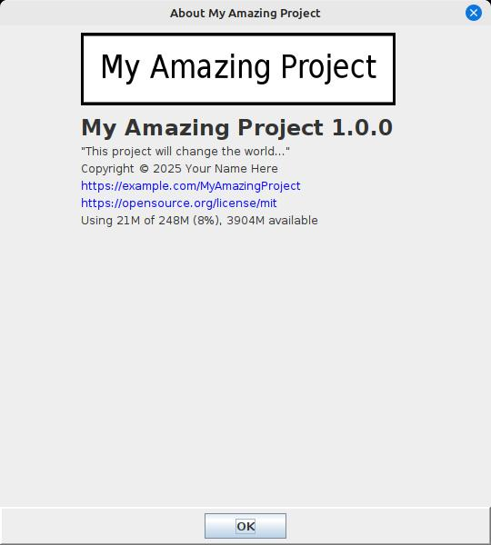
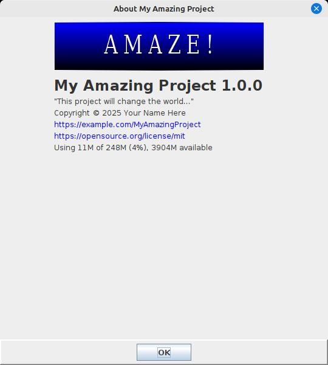
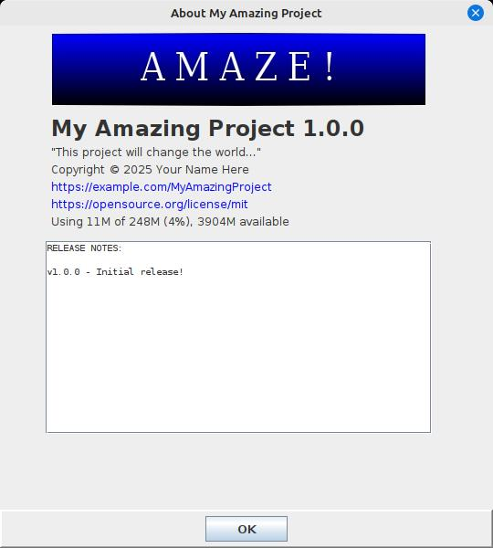
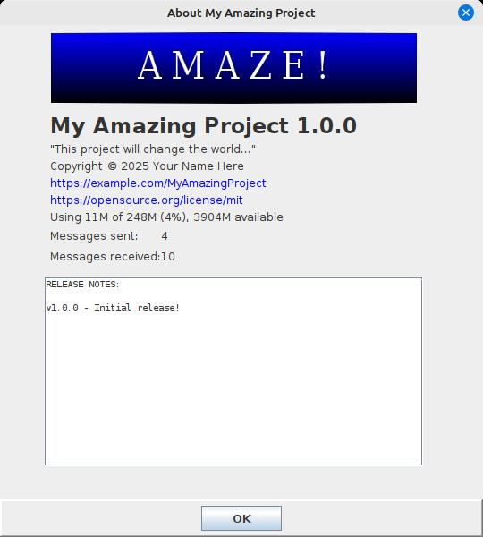

# AboutPanel

Most applications want to show basic information about themselves, such as what version they are 
and when they were published, etc. Rather than rewriting the UI code for this for each new application,
wouldn't it be nice if you could simply populate an instance of an `AboutInfo` POJO and hand it to
some utility that would generate the UI for you in a consistent way? Well, now there is!

## Basic usage

`AboutInfo` contains many fields, most of which are optional. If an optional
field is not specified, it will not be included in the resulting dialog or panel.
Here's an example of setting up an `AboutInfo` instance for a fictional application:

```java
AboutInfo aboutInfo = new AboutInfo();
aboutInfo.license = "https://opensource.org/license/mit";
aboutInfo.copyright = "Copyright © 2025 Your Name Here";
aboutInfo.projectUrl = "https://example.com/MyAmazingProject";
aboutInfo.applicationName = "My Amazing Project";
aboutInfo.applicationVersion = "1.0.0";
aboutInfo.shortDescription = "This project will change the world...";
```

Now, we can hand this `AboutInfo` object to an `AboutPanel` or to an `AboutDialog`:

```java
new AboutDialog(myMainWindow, aboutInfo).setVisible(true);
```



We see a logo image was automatically generated for us, because we didn't specify
one, and we see that the links to our project URL and license URL were automatically
made clickable (if the JRE supports desktop browsing). We also note that JVM memory
usage stats were added automatically.

But this dialog looks a little plain. Can we improve it a bit? Yes, we can...

## Customizing the logo image

The default generated logo image looks a bit bland, but we're seeing that because
we didn't specify one of our own. Let's hire a graphic designer to come up with
something more visually interesting, and then we can specify it in our `AboutInfo`:

```java
aboutInfo.logoImageLocation = "/myapp/images/logo.jpg";
```



Looks better! The logo image is recommended to be around 480x90 pixels, but
you can experiment to see what works. You can also look at `AboutInfo.LogoDisplayMode`
to learn about how the logo image can be positioned on the form.

Let's continue customizing the dialog for our application:

## Specifying release notes

Another common use of an About dialog is to show the application release notes.
With `AboutInfo`, you can either specify these as a text file in your resources
somewhere, or just as a text string:

```java
// Option 1: inline text:
String releaseNotes = "RELEASE NOTES:\n\n"
                + "v1.0.0 - Initial release!\n";
aboutInfo.releaseNotesText = releaseNotes;

// OR Option 2: specify a resource file:
aboutInfo.releaseNotesLocation = "/myapp/releaseNotes.txt";
```



If both options are specified, `releaseNotesText` will be used and `releaseNotesLocation`
will be ignored. If either option is specified, a read-only text area will
appear on the dialog, with a scrollbar if needed. Line wrapping is done automatically
as needed, or "\n" can be used for manual newlines.

## Adding custom fields

Often it's nice to be able to supply custom information to the About dialog.
This can be done in the form of name:value pairs of Strings:

```java
aboutInfo.addCustomField("Messages received:", "10");
aboutInfo.addCustomField("Messages sent:", "4");
```



We now see that our custom fields `Messages sent` and `Messages received` appear
on the About dialog.

But these fields represent dynamic values that will change during the lifetime
of the application. Can we change them once they are set?

```java
aboutInfo.updateCustomField("Messages received:", "99");
aboutInfo.updateCustomField("Messages sent:", "50");
```


We see that the values have been updated. We can call `updateCustomField` whenever
our custom field values change. Any AboutPanel or AboutDialog that is currently
showing will be updated immediately, and any panel or dialog that is shown with
that `AboutInfo` object from that point on will also reflect the latest values.

## Panel vs Dialog

Sometimes, you may not want to show this information in the form of a popup
dialog, but rather embedded somewhere within one of your application windows.
You can use `AboutPanel` for this purpose instead of `AboutDialog`:

```java
AboutPanel aboutPanel = new AboutPanel(aboutInfo);
myContainerPanel.add(aboutPanel);
```

Now your `AboutPanel` can be embedded wherever you like within your application.
Behind the scenes, `AboutDialog` also uses an `AboutPanel` instance, so the
look and feel, and the contents are guaranteed to be the same.
