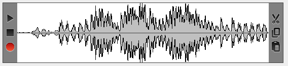
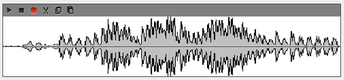
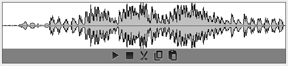
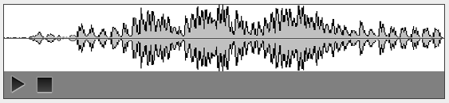
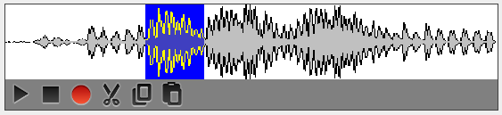
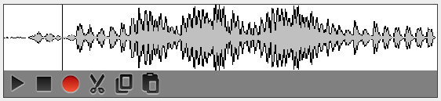
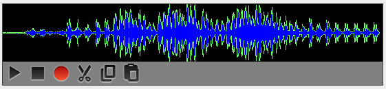

# AudioUtil

`AudioUtil` provides convenience methods for loading and playing audio clips in `wav` format.
Java unfortunately stopped supporting the `mp3` format out of the box, but you can download
a 3rd party library to add support for that format if you wish. See my
[musicplayer application](https://github.com/scorbo2/musicplayer) for an example.

Let's look at some of the handy methods in `AudioUtil` (javadocs omitted for brevity):

```java
public static PlaybackThread play(File audioFile, PlaybackListener listener) {...}
public static PlaybackThread play(BufferedInputStream inStream, PlaybackListener listener) {...}
public static PlaybackThread play(int[][] audioData, PlaybackListener listener) {...}
public static PlaybackThread play(File audioFile, long offset, long limit, PlaybackListener listener) {...}
public static PlaybackThread play(BufferedInputStream inStream, long offset, long limit, PlaybackListener listener) {...}
public static PlaybackThread play(int[][] audioData, long offset, long limit, PlaybackListener listener) {...}

public static int[][] parseAudioFile(File file) throws UnsupportedAudioFileException, IOException {...}
public static int[][] parseAudioStream(BufferedInputStream inStream) {...}
public static void saveAudioFile(File file, int[][] audioData) throws IOException {...}
public static AudioInputStream getAudioInputStream(int[][] audioData) {...}

public static BufferedImage generateWaveform(File file) throws UnsupportedAudioFileException, IOException {...}
public static BufferedImage generateWaveform(BufferedInputStream audioStream) {...}
public static BufferedImage generateWaveform(File file, WaveformConfig prefs) {...}
public static BufferedImage generateWaveform(BufferedInputStream audioStream, WaveformConfig prefs) {...}
public static BufferedImage generateWaveform(int[][] audioData, WaveformConfig prefs) {...}
```

Full javadocs are available online: http://www.corbett.ca/swing-extras-javadocs

We can see that we have many options for loading and playing audio clips, and also for generating a "waveform image".
But what is a waveform image?

## Generating an audio waveform image and editing it

The `WaveformConfig` and `AudioWaveformPanel` classes allow you to
visualize an audio waveform by generating a visual representation
of the audio waveform data. Once you have an audio clip loaded into an
`AudioWaveformPanel`, you also optionally have controls to manipulate it:



The controls on the left allow you to play the current clip, stop playing, or
record a new clip to replace the clip currently being displayed. The controls on
the right allow you to cut, copy, or paste based on mouse selections you make
within the panel. The position and size of these controls are customizable:

```java
// Make the controls x-small and put them in top-left position:
audioWaveformPanel.setControlPanelPosition(ControlPanelPosition.TOP_LEFT);
audioWaveformPanel.setControlPanelSize(ControlPanelSize.XSMALL);
```



You also have the ability to disable recording within the panel, to force it to
be for playback only:

```java
// Make the controls normal size, put them bottom-center, and disable recording:
audioWaveformPanel.setControlPanelPosition(ControlPanelPosition.BOTTOM_CENTER);
audioWaveformPanel.setControlPanelSize(ControlPanelSize.NORMAL);
audioWaveformPanel.setRecordingAllowed(false);
```



And you can disable the cut/copy/paste functionality to make the panel truly
read-only:

```java
// Make the controls large in bottom-left, and truly read-only:
audioWaveformPanel.setControlPanelPosition(ControlPanelPosition.BOTTOM_LEFT);
audioWaveformPanel.setControlPanelSize(ControlPanelSize.LARGE);
audioWaveformPanel.setRecordingAllowed(false);
audioWaveformPanel.setEditingAllowed(false);
```



If editing is enabled, you can click and drag in the panel to select a portion
of the audio to be cut or copied:



And you can left-click in the panel to set an insertion point for paste operations:



### Customizing the display

Of course, the default grey and black and white display may be a bit drab and boring.
Naturally, it's fully customizable, using the `WaveformConfig` class:

```java
WaveformConfig waveformConfig = new WaveformConfig();
waveformConfig.setBgColor(Color.BLACK);
waveformConfig.setFillColor(Color.BLUE);
waveformConfig.setOutlineColor(Color.GREEN);
audioWaveformPanel.setWaveformPreferences(waveformConfig);
```



### Fine-tuning waveform image generation

If the input audio clip is very long, this may result in very wide images,
as by default `AudioUtil` does not limit the output image width. You can control
this with `setXLimit`:

```java
// Scale the waveform down so it will fit into 1024 horizontal pixels:
waveformConfig.setXLimit(1024);
```

You also have options for controlling the x and y scaling values that AudioUtil
will use when generating the resulting image, but this relies on knowing how much
audio data will be present in the input clip:

```java
waveformConfig.setXScale(4096); // default is 1024 but let's make it smaller
waveformConfig.setYScale(32); // default is 64 but let's make it taller
```

By adjusting `xLimit`, `xScale`, and `yScale`, you can create images of different
shapes and sizes to represent your audio data.

## Real-world example

For a real-world example of how `AudioUtil` can be used in an application, I refer
you to my own [musicplayer application](https://github.com/scorbo2/musicplayer):


