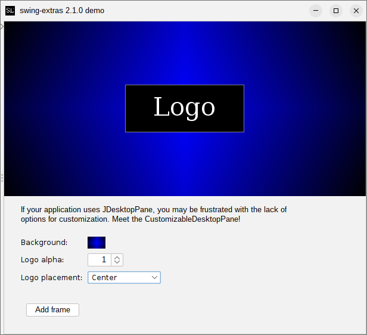

# DesktopPane

If your application uses `JDesktopPane`, you may be frustrated with the lack of options for
customization. Meet the `CustomizableDesktopPane`!

The idea here is that you can add a color gradient background (using the [GradientConfig](../images/Gradients.md) 
which we will discuss later in this guide), and also display a custom logo in some corner of the desktop.

You can programmatically change the positioning and the transparency of the logo image:

This is purely cosmetic, of course, but it can be accomplished with only a few lines of code, and immediately
makes your `JDesktopPane`-based application look a lot nicer (and much more customizable for your users,
if you decide to expose the gradient configuration to them).

## Real-world example

For a real-world example of the use of this component, I refer you to my own Snotes application:

