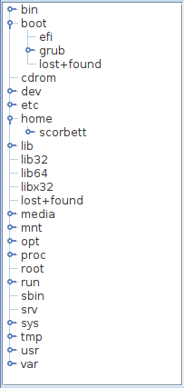
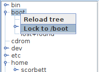
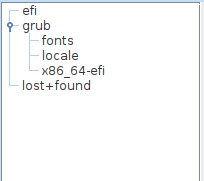
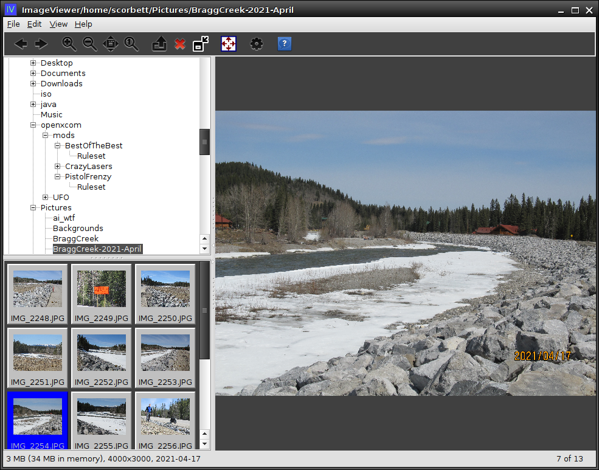

# DirTree

DirTree is a component that gives you a read-only view onto a file system, with the
optional ability to "lock" the view (chroot-style) to a specific directory.



Right-clicking on the tree will allow you to lock the tree to the given node:



This has an effect similar to `chroot`, in that the `DirTree` component now
views that directory as the root of the filesystem, and can only see directories
underneath it:



You can then right-click again to unlock the tree.

Locking and unlocking can be allowed or disallowed programmatically:

```java
// Create a DirTree for my home directory and disallow locking/unlocking:
DirTree myDirTree = DirTree.createDirTree(new File("/home/scorbett"));
myDirTree.setAllowLock(false);
myDirTree.setAllowUnlock(false);
```

## Detecting and responding to events

Of course, displaying a read-only view of a file system is not terribly useful
without the ability to detect user selection events:

```java
myDirTree.addDirTreeListener(new DirTreeListener() {
    @Override
    public void selectionChanged(DirTree source, File selectedDir) {
        // The selection has changed
    }
    
    @Override
    public void treeLocked(DirTree source, File lockDir) {
        // Tree has been locked to lockDir
    }

    @Override
    public void treeUnlocked(DirTree source) {
        // Tree has been unlocked
    }
});
```

Now you can respond to selection changes by, for example, displaying a list of
files in the current directory in some other part of your application UI.

## Programmatic selection

You can also programmatically lock the `DirTree` to any
particular directory, regardless of whether locking is enabled or disabled
for the user:

```java
myDirTree.lock(new File("/some/other/dir"));
```

And you can select a particular directory, and cause the `DirTree` to scroll
if necessary so that it is visible in the view:

```java
myDirTree.selectAndScrollTo(new File("/some/nested/dir/somewhere/else"));
```

## Real-world example

For a real-world usage of the `DirTree` component, I refer you to my own `imageviewer` application:


