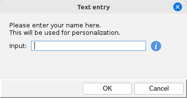
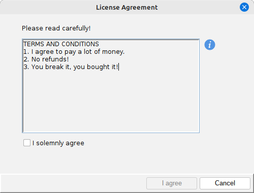

# Input Dialogs

The swing-extras library provides a couple of pre-built dialogs that you can use to get input from the user.

## MessageUtil

The [MessageUtil](MessageUtil.md) class provides simple wrappers around `JOptionPane`, for gathering
simple input from the user, such as Yes/No questions, text input, or selection from a list of options.

## TextInputDialog

`TextInputDialog` goes a bit further by allowing for custom validation on user input by 
re-using the `FieldValidator` interface from swing-forms, and for allowing more customization
over the input dialog itself.

In the simple case, it can be used to quickly get text input from the user, either single-line
or multi-line:

```java
// Specify SingleLine or MultiLine:
TextInputDialog dialog = new TextInputDialog("Text entry", 
                                  TextInputDialog.InputType.SingleLine);
dialog.setVisible(true);
String result = dialog.getResult(); // null if user canceled
```

To give the user more context, you can optionally specify help text for the input field. This will be
displayed with an informational icon next to the input field, exactly as with swing-forms. Hovering over
the icon will display the help text:

```java
dialog.setHelpText("Please enter your name here.");
```

You can also optionally specify "overview text", which is displayed in a label above the input field.
This can be multi-line if you wrap the text in `html` tags:

```java
dialog.setOverviewText("<html>Please enter your name here." +
                               "<br>This will be used for personalization.</html>");
```

This looks like this:



### Validation

You can also optionally specify `FieldValidator` instances that will be invoked when the user tries to OK
the dialog. These validators can apply whatever custom validation rules you want:

```java
private class CustomValidator implements FieldValidator<FormField> {

    @Override
    public ValidationResult validate(FormField fieldToValidate) {
        String text = getText(fieldToValidate);
        if (text == null) {
            return ValidationResult.valid();
        }

        // Let's impose a minimum length as an example validation:
        if (text.length() < 5) {
            return ValidationResult.invalid("Input must be at least 5 characters long.");
        }

        return ValidationResult.valid();
    }

    /**
     * Note that our input field might be a ShortTextField or a LongTextField,
     * depending on how the dialog was configured. We should cover both.
     */
    private String getText(FormField field) {
        String text = null;
        if (field instanceof ShortTextField shortTextField) {
            text = shortTextField.getText();
        }
        else if (field instanceof LongTextField longTextField) {
            text = longTextField.getText();
        }
        return text;
    }
}
```

Then applying your validator is quite easy:

```java
dialog.addValidator(new CustomValidator());
```

## AgreementDialog

The `AgreementDialog` simply displays some read-only multi-line text to the user, and offers a checkbox
with a customizable label. The checkbox must be checked in order for the user to be able to close the dialog.
This could be used for displaying a license agreement or terms of service, for example:

```java
String agreementText = 
    """
    TERMS AND CONDITIONS
    1. I agree to pay a lot of money.
    2. No refunds!
    3. You break it, you bought it!
    """;
    
AgreementDialog agreementDialog = new AgreementDialog("License Agreement", agreementText);
agreementDialog.setAgreementText(agreementText);
agreementDialog.setCheckBoxText("I solemnly agree");
agreementDialog.setConfirmLabel("I agree");
agreementDialog.setHelpText("Please read before agreeing");
agreementDialog.setOverviewText("Please read carefully!");
agreementDialog.setVisible(true);

The `AgreementDialog` has the same "overview text" and "help text" options as `TextInputDialog`, 
which work the same way.

All together, it looks like this:


