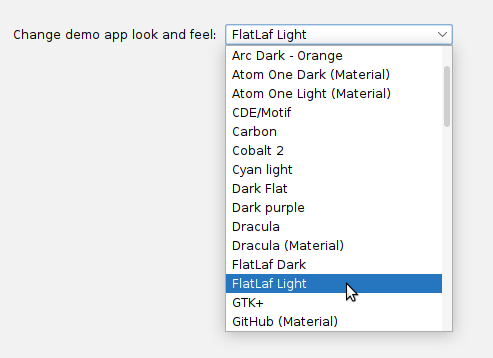
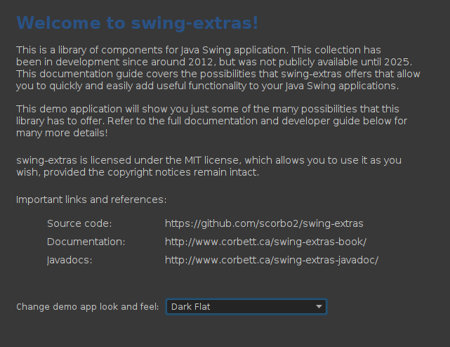
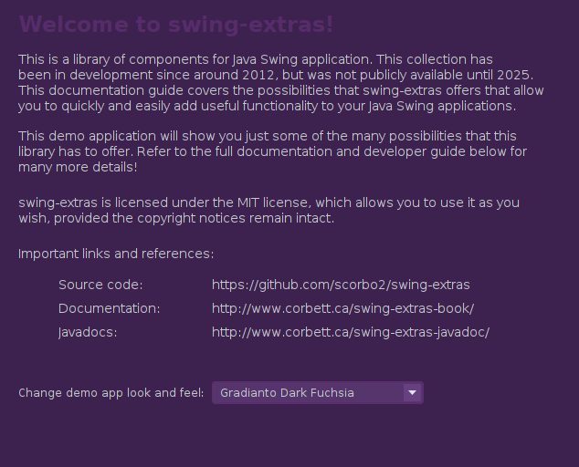

# Look and Feel

By default, Java Swing applications have access to a small number of "look and feels" that can change
how components are rendered and which colors are used to display them. The `swing-extras` library
packages additional look and feels from FlatLaf and JTattoo that go beyond basic customization and
offer a wide variety of options.

We can use the `LookAndFeelManager` and `LookAndFeelProperty` classes to expose these options to the user.

## Option 1: set a Look and Feel programmatically

On startup, you can simply pick one of the available options and set your application to use it:

```java
public static void main(String[] args) {
    LookAndFeelManager.installExtraLafs();
    LookAndFeelManager.switchLaf(FlatLafDark.class.getName());
    
    // Now initialize and show your main window...
}
```

This is the simplest option, and the users of your application will always have the same consistent
Look and Feel.

## Option 2: Allow the user to select look and feel

You can optionally expose a `LookAndFeelProperty` to your users to allow them to pick a look and feel.

```java
LookAndFeelProperty prop = new LookAndFeelProperty("UI.LookAndFeel", "Look and feel:", FlatLafLight.class.getName());
```

The above property defaults to `FlatLafLight`, but gives your users a dropdown to choose from all available options:



To switch to the selected look and feel, we simply need to call upon `LookAndFeelManager`:

```java
LookAndFeelManager.switchLaf(prop.getSelectedLafClass());
```

The `LookAndFeelManager` will handle updating the UI to reflect the new selection. 

## Try it out!

You can try this in the `swing-extras` demo app, on the introduction panel!

  
