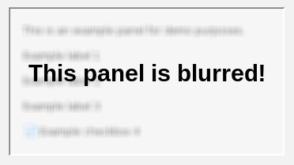
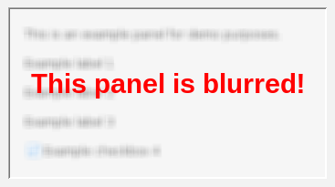
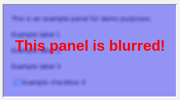
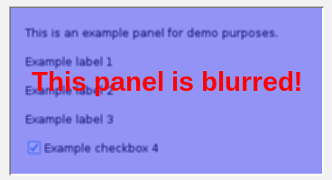
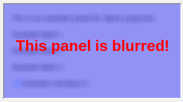
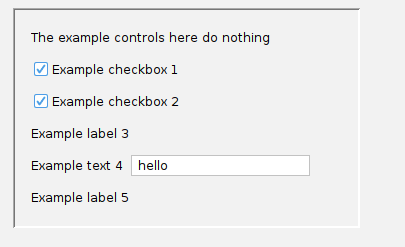
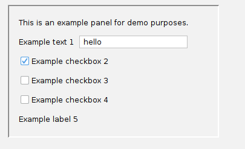
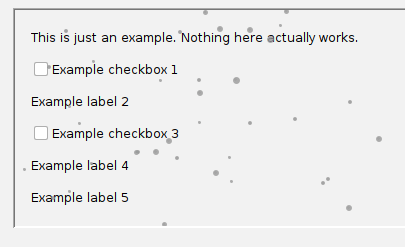
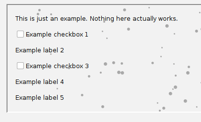

# Panel effects

Just for fun, `swing-extras` includes some simple panel effects that you can use to add
visual effects to any JPanel (or subclass thereof) in your Swing application.

## BlurLayerUI

The `BlurLayerUI` class allows you to apply a blur effect to a panel, to obscure its contents.
An optional text overlay can be rendered on top of the blur panel to explain why the panel is blurred.
For example:

```java
// Create a BlurLayerUI and apply it to a panel:
BlurLayerUI blurUI = new BlurLayerUI();
JLayer<JPanel> blurLayer = new JLayer<>(myPanel, blurUI);
containerPanel.add(blurLayer);

// Now we can blur it!
blurUI.setOverlayText("This panel is blurred!");
blurUI.setBlurIntensity(BlurLayerUI.BlurIntensity.STRONG);
```

This creates an effect like this:



We can customize this, for example by changing the overlay text color:

```java
blurUI.setOverlayTextColor(Color.RED);
```

This results in:



Or, we can add a color tint to the blur effect itself, like this:

```java
blurUI.setBlurOverlayColor(Color.BLUE); // semi-transparent blue tint
```

This gives us:



We can also vary the intensity of the blur from mild to extreme. 
On the weakest setting, the underlying panel contents are still somewhat visible:

```java
blurUI.setBlurIntensity(BlurLayerUI.BlurIntensity.MILD);
```

This produces:



We see that the panel contents are legible, behind the blur overlay. We can make the blur
much stronger by setting the intensity to `STRONG` or `EXTREME`. Here is what the `EXTREME` 
setting looks like:



Now, we see that the original panel contents are unrecognizable.

An interactive demo of `BlurLayerUI` is provided in the built-in demo application.
There, you can experiment with the various settings to see how they affect the appearance of the blur effect.

## FadeLayerUI

If you need to replace the contents of a panel (that is, remove all existing components and add new ones),
you can use the `FadeLayerUI` class to create a smooth fade-out/fade-in transition effect, rather
than simply swapping the contents abruptly. This is set up largely the same way the BlurLayerUI is, with
the exception that we provide a `Runnable` that is executed when the fade completes, so that we can
swap in the new contents. For example:

```java
// Create a FadeLayerUI and apply it to a panel:
FadeLayerUI fadeUI = new FadeLayerUI();
JLayer<JPanel> fadeLayer = new JLayer<>(myPanel, fadeUI);
containerPanel.add(fadeLayer);

fadeUI.fadeOut(() -> {
    // Swap panel contents here...
    
    // Then, we can fade in on the new panel:
    fadeUI.fadeIn(null);
});
```

With default fade settings, it looks like this:



We can customize the fade duration, animation speed, and fade color. For example:

```java
// Make the fade transition last longer:
fadeUI.setAnimationDuration(FadeLayerUI.AnimationDuration.VeryLong);

// Let's fade to blue instead of the default white:
fadeUI.setFadeColor(Color.BLUE);

// We can control the FPS of the animation too:
fadeUI.setAnimationSpeed(FadeLayerUI.AnimationSpeed.MEDIUM);
```

Now, our fade looks like this:



Pretty neat!

## Falling snow

This one has absolutely no practical purpose whatsoever, but if you've ever wanted to animate
falling snowflakes on top of a panel, well, this one's for you! The `SnowLayerUI` class provides a simple
way to add falling snow animation to any JPanel. For example:

```java
// Create a SnowLayerUI and apply it to a panel:
SnowLayerUI snowUI = new SnowLayerUI();
JLayer<JPanel> snowLayer = new JLayer<>(myPanel, snowUI);
containerPanel.add(snowLayer);

// Let's make the snow gray instead of white,
// so we can see it more easily:
snowUI.setSnowColor(Color.GRAY);

// Start the snow animation:
snowUI.letItSnow(true); // Let it snow!
```

This produces gently falling snowflakes over the panel, like this:



We can change the amount of snow, and also introduce "wind" (horizontal drift)
if we want:

```java
snowUI.setQuantity(SnowLayerUI.Quantity.VeryStrong);
snowUI.setWind(SnowLayerUI.Wind.MildRight); // gentle, to the right
```

That results in:



Unlike with the BlurLayerUI or the FadeLayerUI, when the snow is falling, the underlying panel
remains fully interactive, so users can still click buttons, enter text, etc.

## Interactive demo

The built-in demo application contains an interactive demo of all of these panel effects.
Try them out for yourself! Perhaps they can be fun additions to your own applications.
