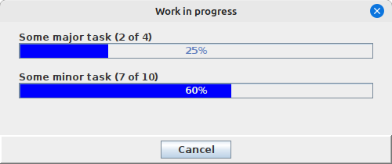

# Progress utilities

Java comes with a couple of useful classes out of the box:

- `ProgressMonitor` is useful for showing a very simple progress dialog
- `SplashScreen` is useful for showing an image as your application starts up

But both of these are very limited in what they can do. Can we improve upon them?
Yes we can!

## MultiProgressDialog

Often it's useful not just to show progress as a linear list of steps (eg. processing
file 3 of 10), but rather as a list of major and minor progress steps. For example,
when processing a large number of files recursively in a large directory tree,
it might be useful to have a major progress bar to show the number of directories
to be processed, and a minor progress bar to show the number of files in the
directory that is currently being processed. Let's look at MultiProgressDialog:



Setting up a MultiProgressDialog is reasonably straightforward. We start by extending
the `MultiProgressWorker` class and implementing the `run` method:

```java
public class MyWorker extends MultiProgressWorker {

    @Override
    public void run() {
        // worker logic goes here
    }
};
```

We can use the various `fire...` methods in the parent class to let listeners know
what we're up to. This is very important, as we'll see later:

```java
@Override
public void run() {
    fireProgressBegins(majorStepCount);
    boolean wasCanceled = false;
    boolean isComplete = false;
    while (!wasCanceled && !isComplete) {
        wasCanceled = !fireMajorProgressUpdate(...);

        for (int i = 0; (i < minorStepsCount) && !wasCanceled; i++) {
            wasCanceled = !fireMinorProgressUpdate(...);
            // Do some work here...
        }
        
        if (noMoreMajorStepsToDo()) {
            isComplete = true;
        }
    }
    if (wasCanceled) {
        fireProgressCanceled();
    } else {
        fireProgressComplete();
    }
}
```

The basic skeleton of our `run` method fires a `progressBegins` message when we
start processing, a `majorProgressUpdate` message as we start to process each
major work step, and a `minorProgressUpdate` message as we start to process
each minor work step. Upon completion (or user cancellation via the Cancel button),
we fire either a `progressCanceled` message or a `progressComplete` message.

So, what is listening to all these messages? Our `MultiProgressDialog`, of course!
(You can also add your own listener to handle things like logging of each
work step or whatnot).

Once our `MultiProgressWorker` is ready to go, we can hand it to the
`MultiProgressDialog` to begin the work:

```java
MultiProgressDialog dialog = new MultiProgressDialog(myMainWindow, "Progress");
dialog.runWorker(worker, true);
```

The dialog will show itself, update itself as the work progresses, and then
close itself when complete. If you attached a listener, you can receive notification
when the work is complete. The dialog presents a Cancel button which is checked
every time one of the `fire...` methods is invoked. If the method returns false,
the user clicked the Cancel button and processing should stop.

## SplashProgressWindow

The built-in Java `SplashScreen` class is handy for showing a static image briefly
on the screen as your application starts up. But perhaps your application has to do
some expensive loading or preparation work as it starts up, and simply showing a static
image to the user is not very enlightening. Wouldn't it be nice if we could show
a progress bar with our splash screen so that the user can visually see the application
starting up? Let's look at `SplashProgressWindow`!


Everything you see is customizable. If you have a static image you wish to show, you
can supply it to the constructor:

```java
mySplashWindow = new SplashProgressWindow(Color.WHITE, Color.BLACK, myImage);
mySplashWindow.runWorker(myWorker);
```

The process for creating a worker thread is very similar to what we saw with
`MultiProgressWorker` above, except now we will extend the `SimpleProgressWorker`
class instead, which allows one single progress bar to show progress:

```java
public class MyWorker extends SimpleProgressWorker {
    @Override
    public void run() {
        boolean shouldContinue;
        shouldContinue = fireProgressBegins(steps);
        for (int i = 0; (i < steps) && shouldContinue; i++) {
            shouldContinue = fireProgressUpdate(i, "");
            // Do some loading work here
        }
        fireProgressComplete();
        if (action != null) {
            action.actionPerformed(new ActionEvent(thisWindow, 0, "Complete"));
        }
    }
}
```

Again we rely on the `fire...` methods in the parent class to fire off events so
that the progress bar can be updated as we do work. Since there is no Cancel button
on the splash screen, you may wonder why we still check the return value from these
methods. The reason is that other listeners attached to the worker have the option
of returning false from a message notification, indicating that processing should
stop. This gives you a way of programmatically canceling the dialog if some
condition fails during startup. As with `MultiProgressDialog`, the splash progress
window will automatically close itself when the loading thread completes or
when processing is canceled.

### Generating the splash image dynamically

We can use the `LogoConfig` class from the [LogoGenerator](../images/LogoGenerator.md) code to 
generate a splash image programmatically if we don't have one premade. The example screenshot 
above was in fact generated programmatically using `LogoConfig`:

```java
String appName = "swing-extras";
LogoConfig config = new LogoConfig(appName);

// Set up background color gradient:
config.setBgColorType(LogoConfig.ColorType.GRADIENT);
GradientConfig gradient = new GradientConfig();
gradient.setColor1(Color.BLACK);
gradient.setColor2(Color.BLUE);
gradient.setGradientType(GradientUtil.GradientType.HORIZONTAL_STRIPE);
config.setBgGradient(gradient);

// Set text and border color for progress bar:
config.setTextColorType(LogoConfig.ColorType.SOLID);
config.setTextColor(Color.CYAN);
config.setBorderColorType(LogoConfig.ColorType.SOLID);
config.setBorderColor(Color.CYAN);

// Set border thickness and image dimensions:
config.setBorderWidth(2);
config.setLogoWidth(400);
config.setLogoHeight(100);

new SplashProgressWindow(myMainWindow, appName, config).runWorker(myWorker);
```

The progress image is generated for us and we don't have to hire a graphic designer:


