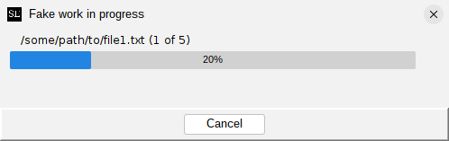
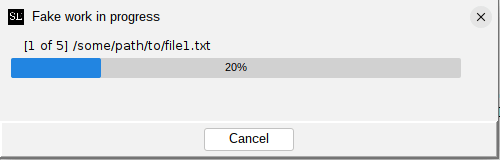
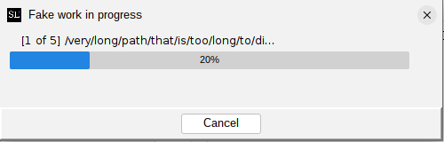
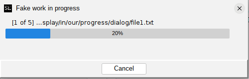

# Formatting progress messages

The `MultiProgressDialog` class now (as of swing-extras 2.7) exposes a formatting option for the status
labels that it displays. The old format was "message (1 of N)", but there are problems with this format.
Consider a list of hypothetical file paths:

```shell
/some/path/to/file1.txt
/some/path/to/file_with_longer_name.txt
/file.txt
/hello/this/is/a/long/file/path/file.txt
/short.txt
```

Because the length of the paths varies greatly, the step counter labels at the end of the string will
jump around, often too rapidly to clearly see them. It looks like this:



The new default format is "[1 of N] message", which places the step counter at the front of the label. This
way, the step counter remains in a fixed position, and is easier to read, even when the messages vary in length:



You can use the `setFormatString()` method to customize the format string used for the progress labels.
You can either use one of the supplied constants to choose from the old format, or the new default format,
or you can supply your own format string:

```java
// Set the old, pre-2.7 format:
dialog.setFormatString(MultiProgressDialog.LEGACY_PROGRESS_FORMAT);

// Set the new default format:
dialog.setFormatString(MultiProgressDialog.DEFAULT_PROGRESS_FORMAT);

// Set your own format!
//    %m = the worker-thread-supplied message
//    %s = the current 1-based step number
//    %t = the total number of steps
dialog.setFormatString("Processing item %s of %t: %m");
```

Keep in mind there is a fixed length limit of 50 characters for the progress label, including the
step counters. Which leads nicely to the next customization option...

## Handling long messages gracefully

The `MultiProgressDialog` will simply truncate progress messages that exceed the length limit, and will
add "..." to indicate that the message was truncated. Prior to swing-extras 2.7, this truncation 
always happened at the end of the message, which can present a problem in some situations.
Consider the following hypothetical file paths:

```shell
/very/long/path/that/is/too/long/to/display/in/our/progress/dialog/file1.txt
/very/long/path/that/is/too/long/to/display/in/our/progress/dialog/file2.txt
/very/long/path/that/is/too/long/to/display/in/our/progress/dialog/file3.txt
/very/long/path/that/is/too/long/to/display/in/our/progress/dialog/file4.txt
/very/long/path/that/is/too/long/to/display/in/our/progress/dialog/file5.txt
```

If truncation happens at the end of the message, we end up losing the most important part of the message: the file name!
It looks like this:



Starting in swing-extras 2.7, you can choose to have truncation happen at the start of the message instead,
so that the important part of the message remains visible. This is done by calling the `setTruncationMode()` method:

```java
// Truncate long messages at the start (new in 2.7):
dialog.setTruncationMode(MultiProgressDialog.TruncationMode.START);
```

Now, our progress messages look like this:



Much better! Now we can see which files are being processed, even when the full paths are too long to fit in the dialog.

Note that no matter which truncation mode you choose, the step counter will always remain fully visible.
Only the message portion of the label is subject to truncation.
