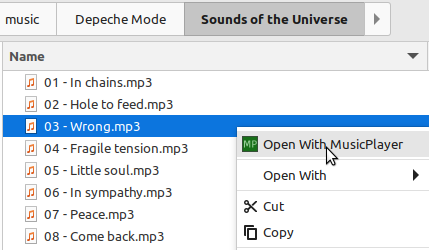

# SingleInstanceManager

Occasionally, you may want to ensure that only one instance of your application is running at a time. 
The `SingleInstanceManager` class provides a straightforward way to achieve this functionality.
The example that we will use here is the [MusicPlayer](https://github.com/scorbo2/musicplayer) application.
Once installed, MusicPlayer allows you to right-click a file in a file explorer window and 
select "Open with MusicPlayer", as shown here:



This queues up the selected song(s) in MusicPlayer and begins playing them. But, by default, the OS
will spawn a new instance of MusicPlayer each time you do this, even if an instance of MusicPlayer
is already running - this is annoying. How can we prevent this?

## Using SingleInstanceManager

The SingleInstanceManager utility class (new in `swing-extras` 2.6) is very easy to use.
In your application startup logic, you simply invoke the `tryAcquireLock()` method.
This method attempts to acquire a lock for the application. If it returns true,
it means that no other instance of the application is running, and your application can
start up as it normally does. If it returns false, however, it means that another instance
of your application is already running. So, your application should terminate itself.
But first, it can send any command-line arguments to the already-running instance
via the `sendArgumentsToRunningInstance()` method. Here's an example of how this works
in the MusicPlayer application:

```java
public static void main(String[] args) {
    // Before we do anything else, set up logging:
    configureLogging();
    
    // Ensure only a single instance is running (if configured to do so):
    boolean isSingleInstanceEnabled = Boolean.parseBoolean(AppConfig.peek("UI.General.singleInstance"));
    if (isSingleInstanceEnabled) {
        SingleInstanceManager instanceManager = SingleInstanceManager.getInstance();
        if (!instanceManager.tryAcquireLock(Main::handleStartArgs)) {
            // Another instance is already running, let's send our args to it and exit:
            // Send even if empty, as this will force the main window to the front.
            instanceManager.sendArgsToRunningInstance(args);
            return;
        }
    }
    
    // Normal application startup logic goes here...
}
```

First, we use `AppConfig.peek()` to check our config for the option to enable single-instance mode.
If enabled, we attempt to acquire the lock via `tryAcquireLock()`, passing in a method reference
to handle any startup arguments that are sent to the running instance. If we fail to acquire the lock,
we send our command-line arguments to the running instance via `sendArgsToRunningInstance()`, and then exit.

But what exactly did we pass to the `tryAcquireLock()` method? It's a method reference to a static
method called `handleStartArgs()`. This method will be invoked automatically by the `SingleInstanceManager`
in the already-running instance whenever another instance tries to start up and send it arguments.
Here's what that method looks like in MusicPlayer:

```java
/**
 * Invoked internally to handle start arguments on the EDT.
 */
private static void handleStartArgs(List<String> args) {
    SwingUtilities.invokeLater(() -> MainWindow.getInstance().processStartArgs(args));
}
```

This method simply forwards the arguments to the main window of the application,
which knows how to handle them appropriately (in this case, queueing up the songs to play).
We ensure that the processing happens on the EDT via `SwingUtilities.invokeLater()`.

## Behind the scenes - TCP ports

There are multiple ways that this feature might have been implemented:

- File locks (unreliable on some platforms)
- Domain sockets (not supported on all platforms, requires OS-specific code)
- Sockets / TCP ports

SingleInstanceManager uses TCP ports to implement its functionality. When the first instance
of the application starts up, it attempts to bind to a specific TCP port on localhost.
There's an optional second parameter to `tryAcquireLock()` that allows you to specify
the port number to use. If you don't specify a port, a default port number is used.

### But what about cleanup?

SingleInstanceManager registers a shutdown hook with the JVM to automatically release the port lock
when the application exits, so you don't have to worry about cleaning up the port manually.
There is a `release()` method that you can call manually if you want to release the lock
before the application exits. For example, MusicPlayer makes use
of that feature, because "single instance mode" can be enabled or disabled on the fly, via application settings.