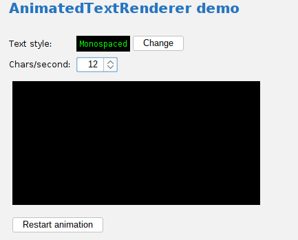
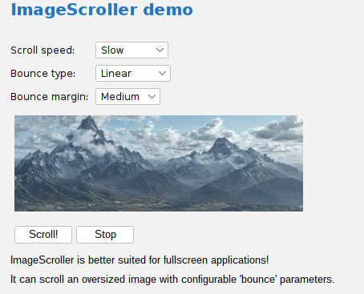

# Animation

There are some animation classes in swing-extras that are well-suited for fullscreen applications!

## AnimatedTextRenderer

The `AnimatedTextRenderer` can be easily wired into an animation loop to type out a text message
with configurable styling at a configurable rate (in characters typed per second). Line wrap
is handled automatically and the animation can be paused/restarted at any point. An optional
cursor can be shown as the text is typed out, and the cursor can be optionally made to blink
as it moves.

## ImageScroller

ImageScroller is more intended for fullscreen applications rather than Swing desktop applications.
It can scroll an oversized image, either horizontally or vertically, with a configurable "bounce" when 
a scroll limit is reached. This "bounce" causes the image scrolling to slow as a scroll limit is reached,
and then speed up again gradually after the scrolling reverses direction.

For an actual example of this, I refer you to the [Scenery extension](https://github.com/scorbo2/ext-mp-scenery)
for [MusicPlayer](https://github.com/scorbo2/musicplayer).
