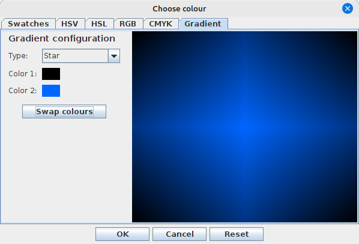
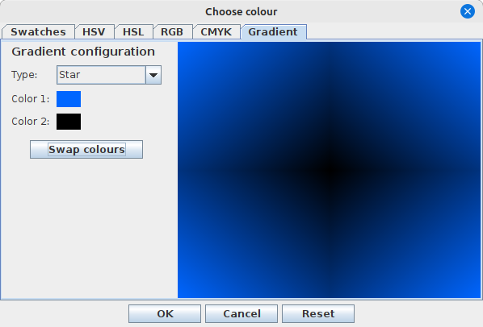
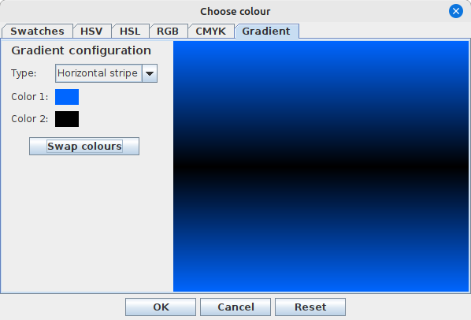
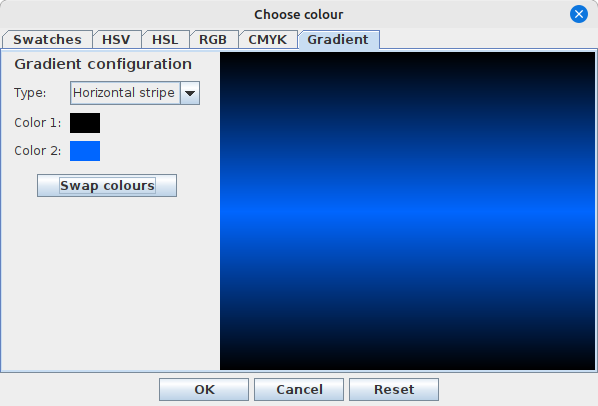

# Gradients

The `ca.corbett.extras.gradient` package contains some neat utilities and components related
to color gradients. Let's start with a visual demonstration of the capabilities, and then take
a look at the code.

 
 

We can also render text with a color gradient:


## Integration with swing-forms

The `ColorField` in swing-forms understands both solid colors or color gradients, and allows
you to present a form field for user selection of both or of either. You can also use the
`GradientColorChooser` to allow your users to configure a color gradient interactively if you
are not working with swing-forms.

## Integration with properties

The `ColorProperty` property in `ca.corbett.extras.properties` understands both solid colors
or color gradients, and allows you to create a property that allows the user to choose either
one, or restricts them to one or the other.

## Other integrations

If your application uses a `JDesktopPane`, you may want to consider upgrading to the
`swing-extras` class [CustomizableDesktopPane](../general/DesktopPane.md), which allows you
to use a gradient as a background.

Of course, the gradient images generated by the `GradientUtil` are compatible with
`ImageUtil`, so you can easily generate gradient images and save them.

## How do I generate gradients?

Everything is driven from the `Gradient` record, which is very easy to set up:

```java
public record Gradient(GradientType type, Color color1, Color color2) {

    public static Gradient createDefault() {
        return new Gradient(GradientType.VERTICAL_STRIPE, Color.WHITE, Color.BLACK);
    }
}}
```

This record contains a static factory method for creating a "default" gradient quickly
and easily, or you can create a new one by specifying the start and end colors for the gradient,
and then selecting a `GradientType`:

```java
public enum GradientType {

    /**
     * Describes a single gradient that progresses linearly from left to right, color 1 to color 2.
     */
    HORIZONTAL_LINEAR("Horizontal linear"),

    /**
     * Describes a single gradient that progresses linearly from top to bottom, color 1 to color 2.
     */
    VERTICAL_LINEAR("Vertical linear"),

    /**
     * Describes a two-part gradient that progresses linearly from top to center, color 1 to
     * color 2, and then center to bottom, color 2 to color 1. The end result is a gradient that
     * looks like a horizontal stripe running along the center of the image.
     */
    HORIZONTAL_STRIPE("Horizontal stripe"),

    /**
     * Describes a two-part gradient that progresses linearly from left to center, color 1 to
     * color 2, and then center to right, color 2 to color 1. The end result is a gradient that
     * looks like a vertical stripe running up the center of the image.
     */
    VERTICAL_STRIPE("Vertical stripe"),

    /**
     * Represents a single gradient that progresses linearly from top left to bottom right,
     * color 1 to color 2.
     */
    DIAGONAL1("Diagonal 1"),

    /**
     * Represents a single gradient that progresses linearly from bottom left to top right,
     * color 1 to color 2.
     */
    DIAGONAL2("Diagonal 2"),

    /**
     * Describes a four-part gradient that progresses linearly from each corner of the image
     * towards the center, color 1 to color 2.
     */
    STAR("Star");
    
    // ...
}
```

From there, we can talk to the `GradientUtil` class, which has methods for actually rendering the gradient:

```java
public static BufferedImage createGradientImage(Gradient conf, int width, int height) {...}
public static void fill(Gradient conf, Graphics2D graphics, int x1, int y1, int width, int height) {...}
public static void drawRect(Gradient conf, Graphics2D graphics, int x1, int y1, int width, int height) {...}
public static void drawString(Gradient conf, Graphics2D graphics, int textX, int textY, String string) {...}
public static void drawString(Gradient conf, Graphics2D graphics, int gradientX1, int gradientY1, 
                              int gradientX2, int gradientY2, int textX, int textY, String string) {...}
```

We see that every method requires a `Gradient` record which describes the gradient to be rendered, and then there
are options to control the size and shape of the gradient. Very easy to use, and can produce quite nice results!

