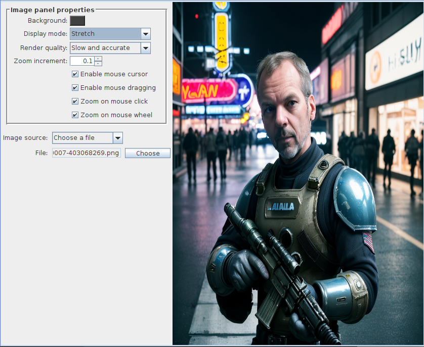

# ImagePanel

The `ImagePanel` is a custom `JPanel` implementation that can display an image with many options
for determining how the image is to be displayed. All images types are supported - even animated GIF 
images can be displayed!

Here we see that the image to be displayed does not perfectly fit into the `ImagePanel`. That's not
a problem - we select the `BEST_FIT` display option, and the image will be scaled down to fit inside
the panel, without stretching or distorting the image in the process. This may result in empty space
either above and below the image (as seen above), or on the left and right sides of the image,
depending on whether the image to be displayed is too wide or too tall to fit inside the panel.

We can change the display option to `STRETCH` if we want the image to completely fill the panel, but
this will result in distorting the image to make it fit:

We also have options for allowing the mouse wheel to zoom in and out of the image, and allowing
to click+drag the mouse when zoomed in, to scroll the image around in the panel. `ImagePanel`
also offers performance-related options for deciding whether to prioritize image quality versus
speed when doing things such as scaling and zooming.
