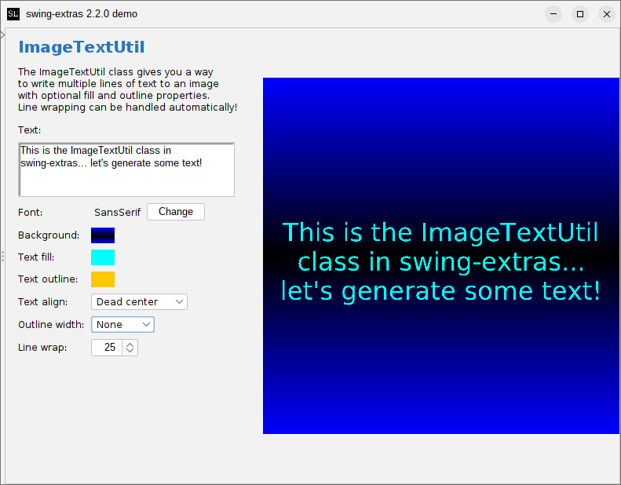

# ImageTextUtil

With the `ImageTextUtil` utility class, we can easily render text onto an image, with many
configuration options:



Let's look at the methods that we have available to us here (javadoc omitted for brevity):

```java
public static void drawText(BufferedImage image, String text) {...}
public static void drawText(BufferedImage image, String text, Font font, Color outlineColor, Color fillColor) {...}
public static void drawText(BufferedImage image, String text, Font font, Color outlineColor,
                            Color fillColor, TextAlign align) {...}
public static void drawText(BufferedImage image, String text, int lineLength, Font font,
                            TextAlign align, Color outlineColor, float outlineWidthFactor, Color fillColor) {...}
public static void drawText(BufferedImage image, String text, int lineLength, Font font,
                            TextAlign align, Color outlineColor, float outlineWidthFactor,
                            Color fillColor, BufferedImage fillTexture, Rectangle rect) {...}
```

We see that the simplest option simply takes the `BufferedImage` onto which we should render the text,
and the text itself. There are more and more complicated overloads of this method to expose further
configuration options for rendering the text. 

We can use the `lineLength` parameter to determine at what point (based on character count) line-wrapping
should occur. If not specified, the default line length is 30 characters.

We can also control the positioning of the text within the image using the `TextAlign` enum:

```java
public enum TextAlign {
    TOP_LEFT("Top left"),
    TOP_CENTER("Top center"),
    TOP_RIGHT("Top right"),
    CENTER_LEFT("Center left"),
    CENTER("Dead center"),
    CENTER_RIGHT("Center right"),
    BOTTOM_LEFT("Bottom left"),
    BOTTOM_CENTER("Bottom center"),
    BOTTOM_RIGHT("Bottom right");
    //...
}
```

