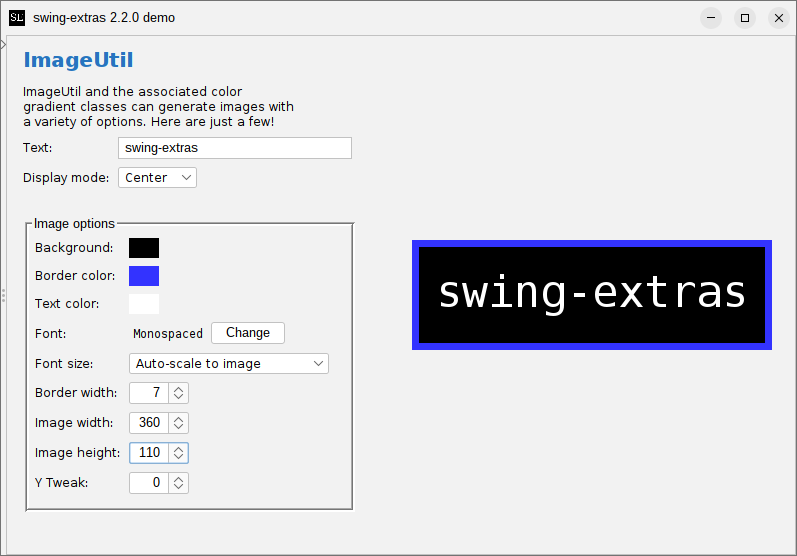

# LogoGenerator

It's worth mentioning an older class that's still around in `swing-extras`, and that is `LogoGenerator`.
This is the class that ultimately led to the creation of [ImageTextUtil](ImageTextUtil.md).

`LogoGenerator` has been used for years as a way to very quickly and easily generate very small,
text-based images, which can be suitable for use for application logo images or banner images
to be shown in an application. It can also be used to generate small square images suitable for
an application icon.



## Generator logo images

We start by populating a `LogoConfig` object describing the image to be generated:

```java
public final class LogoConfig {
    // ...

    public void setLogoWidth(int width) {...}
    public void setLogoHeight(int height) {...}

    public void setYTweak(int tweak) {...}
    public void setBgColorType(ColorType bgColorType) {...}
    public void setBgGradient(GradientConfig bgGradient) {...}
    public void setBgColor(Color bgColor) {...}
    public void setBorderColorType(ColorType borderColorType) {...}
    public void setBorderGradient(GradientConfig borderGradient) {...}
    public void setBorderColor(Color borderColor) {...}
    public void setBorderWidth(int borderWidth) {...}
    public void setHasBorder(boolean hasBorder) {...}
    public void setFont(Font font) {...}
    public void setFontByFamilyName(String fontName) {...}
    public void setTextColor(Color textColor) {...}
    public void setTextColorType(ColorType textColorType) {...}
    public void setTextGradient(GradientConfig textGradient) {...}
    public void setFontPointSize(int fontPointSize) {...}
    public void setAutoSize(boolean auto) {...}
    public void resetToDefaults() {...}

    public void loadFromProps(Properties props, String prefix) {...}
    public void saveToProps(Properties props, String prefix) {...}
    
    // ...
}
```

Once we have configured the properties we want, we can talk to the `LogoGenerator` class:

```java
public final class LogoGenerator {
    // ...
    
    public static BufferedImage generateImage(String text, LogoConfig preset) {...}
    public static void generateAndSaveImage(String text, LogoConfig preset, File outputFile) throws IOException {...}}
}
```

We see that the API here is quite simple. Just specify the text to render and your `LogoConfig` object,
and decide whether you want to receive a `BufferedImage` generated in memory, or whether you want to save
the resulting image directly to disk. Easy!
