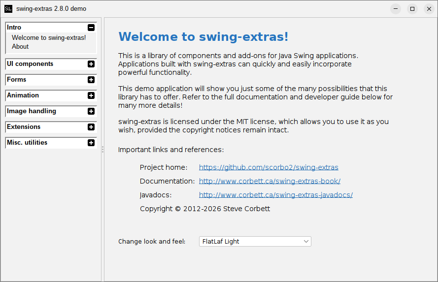

# What is this?

`swing-extras` is a collection of custom components and utilities for Java Swing applications,
to allow developers to very quickly and easily stand up powerful applications with rich UI features.
This documentation guide covers the possibilities that `swing-extras` offers that allow you to 
quickly and easily add useful functionality to your Java Swing applications.

**This guide covers version 2.9.0 of swing-extras from 2026-04-13**

The library jar includes a built-in demo application that offers a brief preview of some of the features and
components of `swing-extras`:



## Getting started

### Option 1: use the Maven archetype to create a new project

There is a [swing-extras Maven archetype](https://github.com/scorbo2/swing-extras-archetype/) in Maven Central
that you can use to very quickly bootstrap a new Java Swing project that uses swing-extras. Many key components
are provided out of the box, and comments are provided to guide you in customizing and extending the generated project.
To use the archetype, run the following command:

```shell
mvn archetype:generate \
  -DarchetypeGroupId=ca.corbett \
  -DarchetypeArtifactId=swing-extras-archetype \
  -DarchetypeVersion=2.9.0 \
  -DgroupId=com.example \
  -DartifactId=my-app \
  -Dversion=1.0.0 \
  -DartifactNamePascalCase=MyApp
```

Just set the `groupId`, `artifactId`, `version`, and `artifactNamePascalCase` properties appropriately for your application.
Always use the latest version of the archetype! `2.9.0` is the latest version at the time of this writing, but
check [Maven Central](https://repo1.maven.org/maven2/ca/corbett/swing-extras-archetype/) for newer versions.

The generated application includes many comments explaining what features were provided for you, and how/where
to add customizations for your application. This is the easiest way to get started with `swing-extras`!

### Option 2: Add swing-extras as a dependency in your existing Maven project

`swing-extras` is available in Maven Central, so you can simply list it as a dependency in your Maven `pom.xml` and
then start building swing-extras features and components into your Swing application!

```xml
<dependencies>
  <dependency>
    <groupId>ca.corbett</groupId>
    <artifactId>swing-extras</artifactId>
    <version>2.9.0</version>
  </dependency>
</dependencies>
```

### Option 3: Clone the repo and build locally

If you want to run the demo app, or if you just want to play with the code locally, then you can clone the repo:

```shell
git clone https://github.com/scorbo2/swing-extras.git
cd swing-extras
mvn package

# Run the built-in demo app:
java -jar target/swing-extras-2.9.0-jar-with-dependencies.jar
```

### Updates, issues, and more information

At the time of this writing, `2.9.0` is the latest version. Use the following links for more information:

- [swing-extras on GitHub](https://github.com/scorbo2/swing-extras)
- Use the [GitHub issues page](https://github.com/scorbo2/swing-extras/issues) to report bugs or request features.
- [Browse the Javadocs online](http://www.corbett.ca/swing-extras-javadocs/)
- [Version history and release notes](https://github.com/scorbo2/swing-extras/blob/master/src/main/resources/swing-extras/releaseNotes.txt)
- [Release announcement archive](https://github.com/scorbo2/swing-extras/blob/master/ReleaseAnnouncements.md)

## License

swing-extras is made available under the [MIT license](https://opensource.org/license/mit). This means that
you can do as you wish with the source code, provided the copyright notices remain intact:

```
Copyright © 2012-2026 Steve Corbett
```

Have fun with it!

## Suggestions and bug reports

Bug reports and feature requests are submitted via [GitHub issues](https://github.com/scorbo2/swing-extras/issues).
Feel free to create a ticket there!
