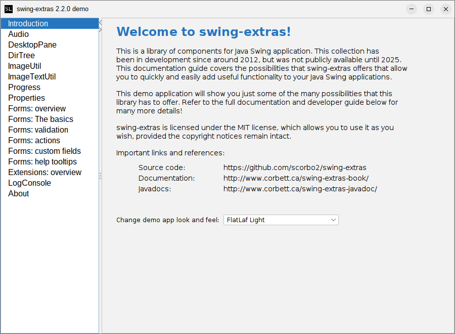

# What is this?

`swing-extras` is a library of components for Java Swing applications. This collection has been in development
since around 2012, but was not publicly available until 2025. This documentation guide covers the possibilities
that `swing-extras` offers that allow you to quickly and easily add useful functionality to your Java Swing
applications.

The library jar includes a built-in demo application that offers a brief preview of some of the features and
components of `swing-extras`:



## How do I get it?

`swing-extras` is in the Maven central repository. So, you can simply list it as a dependency:

```xml
<dependencies>
  <dependency>
    <groupId>ca.corbett</groupId>
    <artifactId>swing-extras</artifactId>
    <version>2.0.0</version>
  </dependency>
</dependencies>
```

At the time of this writing, `2.0.0` is the latest version. You can verify the latest available
version on the GitHub project page:
- <https://github.com/scorbo2/swing-extras>
- [Browse the javadocs online](http://www.corbett.ca/swing-extras-javadocs/)
- [Version history and release notes](https://github.com/scorbo2/swing-extras/blob/master/src/main/resources/swing-extras/releaseNotes.txt)


## License

swing-extras is made available under the [MIT license](https://opensource.org/license/mit). This means that
you can do as you wish with the source code, provided the copyright notices remain intact. Have fun!

## Suggestions and bug reports

Bug reports and feature requests are submitted via [GitHub issues](https://github.com/scorbo2/swing-extras/issues).
Feel free to create a ticket there!

