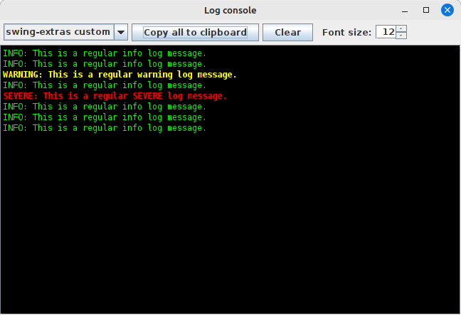
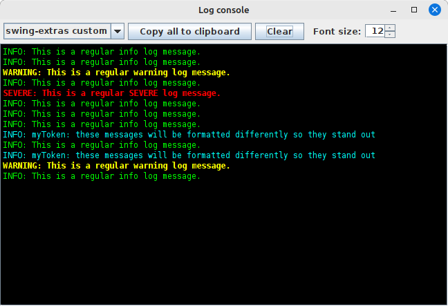

# LogConsole

You can very easily wire up a `LogConsole` instance to give your application a way to present log information
to the user. This saves them the trouble of hunting down the log file or keeping the console handy so that
they can read it:



We enable this by modifying our `logging.properties` file to include our custom log handler:

```properties
handlers=java.util.logging.ConsoleHandler,ca.corbett.extras.logging.LogConsoleHandler
```

Here we see we are writing both to the console and also to our own `LogConsoleHandler`. What does this
do for us? Well, at runtime, we can summon the LogConsole:

```java
LogConsole.getInstance().setVisible(true);
```

This gives the users a way to visually see all log output up to this point. Leaving the LogConsole window
open (it's not modal, so it can sit in the background while you work with the application) can allow you
to keep an eye on it.

But this is arguably no different than just tailing a log file. So what's the use of this?

## Custom styling and log themes

`LogConsole` allows us to set up `LogConsoleStyle` and `LogConsoleTheme` objects. A theme is just a collection
of styles, so let's look at `LogConsoleStyle`:

```java
public final class LogConsoleStyle {
    // ...

    public void setLogLevel(Level logLevel) {...}
    public void setLogToken(String logToken, boolean isCaseSensitive) {...}
    public void setFontColor(Color fontColor) {...}
    public void setFontBgColor(Color fontBgColor) {...}
    public void setFontFamilyName(String family) {...}
    public void setIsBold(boolean isBold) {...}
    public void setIsItalic(boolean isItalic) {...}
    public void setIsUnderline(boolean isUnderline) {...}
    public void setFontPointSize(int fontPointSize) {...}
        
    // ...
}
```

What is it that we're setting up here, exactly? Well, `LogConsole` can scan log messages in real time and apply
styling rules to them based either on the log level (INFO, WARNING, SEVERE, and etc), or based on the content
of the log messages themselves. In the screenshot at the top of the page, we saw that `LogConsole` out of the
box automatically applies a different styling to WARNING or SEVERE messages, to make them stand out. We can
not only override that behaviour, but we can in fact extend it by adding our own styles. You can then make
use of this in your application by having certain log messages contain certain string tokens that might
be more relevant to your users than other log messages. 

For example:
- I want messages that contain "mysql" to appear in blue text so I can see my database calls
- I want messages that contain "removed" or "deleted" to appear in orange so I can see those operations
- I want messages that contain an "@" to appear bold so I can spot log messages that include email addresses
- etc etc

This is very easy to do in `LogConsole`, and it might look something like this:



We've configured it so that any log message that contains the string "myToken" will be formatted in a different
color (and optionally a different font or style if you wish). This helps them visually stand out in the `LogConsole`
in a way that they wouldn't in a console if you were just tailing a log file.

## Matching styles to log messages

The LogConsole will ask the current theme for a matching LogConsoleStyle to use
for each log message that comes in. Style matching is done either by matching
a log Level, or by matching a string token that appears in a log message, or both.
- If a log message matches a style's log token and its log level, that style is considered a strong match for that log message.
- If a log message matches a style's log token, but the style doesn't specify a log level, it is still considered a strong match.
- If a log message matches a style's log level, but the style doesn't specify a log token, then this is considered a weak match. That means that this style will match only if no other style matches the log message.
- If no style matches, either by log token or by log level, then the default style from the current theme will be used for that log message.

## LogConsole is not a substitute for file logging!

Of course, your application should also be logging to a log file, because `LogConsole` is only available while
your application is running and makes no attempt to persist its contents. So, if your application crashes
unexpectedly, you will have lost your log information. 

`LogConsole` is intended to supplement your usual log process, NOT replace it. It's just a handy way to 
view log information at runtime.
