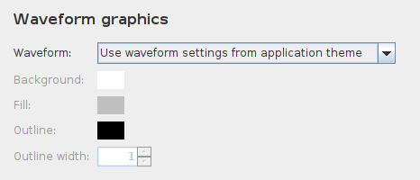
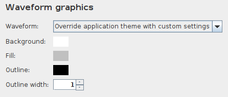

# Custom form logic

It's often a requirement to add custom form logic to the properties dialog, such that certain controls
are only visible or enabled when some other control has a particular value. For example, in the MusicPlayer
application, we want to have the custom waveform style controls disabled, unless the user opts to 
override the application theme settings. When the properties dialog first comes up, the custom style
fields should be disabled, like this:



And then the user selects the override option in the combo box, the form fields underneath it
should be enabled automatically, like this:



How do we accomplish this?

## Setting initial visibility state

Setting the initial state is quite easy. There are methods in `AbstractProperty` that can help with this:

```java
public AbstractProperty setInitiallyEditable(boolean initiallyEditable) { ... }
public AbstractProperty setInitiallyVisible(boolean initiallyVisible) { ... }
```

When we create a new property, we can easily set its initial state based on whatever application logic
we have. And, because all setter methods in `AbstractProperty` use the fluent style (returning a reference
to themselves), we can chain this call quite easily:

```java
BooleanProperty myProp = new BooleanProperty("id", "label", true).setInitiallyEditable(false);
```

Here we are creating a new property and setting its initial editability in one line. We could also
choose to have the control initially invisible, and show it later.

## Implementing custom form logic

Setting the initial state is fine, but we also need to implement logic to toggle the editability and/or
visibility of a field based on changes elsewhere on the properties dialog. How do we do that?

Fortunately, this is quite easy, thanks to the `addFormFieldChangeListener` method in `AbstractProperty`.
Let's look at the actual change listener from the `MusicPlayer` example screenshots above:

```java
// Make sure we respond to change events properly, to enable or disable the override fields:
overrideAppThemeWaveform.addFormFieldChangeListener(event -> {
    boolean shouldEnable = ((ComboField)event.getFormField()).getSelectedIndex() == 1;
    event.getFormPanel().getFormField(waveformBgColor.getFullyQualifiedName()).setEnabled(shouldEnable);
    event.getFormPanel().getFormField(waveformFillColor.getFullyQualifiedName()).setEnabled(shouldEnable);
    event.getFormPanel().getFormField(waveformOutlineColor.getFullyQualifiedName()).setEnabled(shouldEnable);
    event.getFormPanel().getFormField(waveformOutlineThickness.getFullyQualifiedName()).setEnabled(shouldEnable);
});
```

The `PropertyFormFieldChangeListener` interface provides a `valueChanged` method that accepts a
`PropertyFormFieldValueChangedEvent` as a parameter. This `event` parameter contains the FormField that
triggered the change, the FormPanel in which the field is located, and even the AbstractProperty that
owns the field in question. Using this information, and in particular using the `getFormField` method
in `FormPanel` to look up other form fields by their fully qualified name, we are able to look up
whatever fields we need to adjust, and invoke their `setEnabled` or `setVisible` methods as needed.

## Naming properties is important!

In the [previous section](PropertiesDialog.md), we talked about the importance of giving each `AbstractProperty`
a meaningful fully qualified name. As we see in the example code above, this fully qualified name is passed
on to each `FormField` on the generated properties dialog. This is what allows you to look up a form field
when you need to modify its state. 
