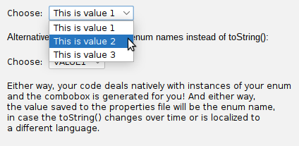
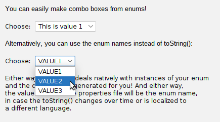

# Working with enums

It's worth taking a moment to look more closely at a very common use case with properties in general:
I want my application to have a property whose available options are determined with an enum. How can I
do that? You could of course use the `swing-extras` class `ComboProperty`, which specifically lets
you store a multi-choice option as a property. It looks like this:

```java
List<String> options = new ArrayList<>();
for (MyEnum value : MyEnum.values()) {
    options.add(value.toString());
}
comboProperty = new ComboProperty("fieldname", "Choose:", options, 0, false);
```

There are several problems with this approach:
- I have to write boilerplate code to get all the values out of the enum
- By using `toString()` to load the value into the combo, I have to parse the String value that comes out of the combo box.
- If the `toString()` changes over time (or gets localized to another language), my properties file breaks.

Alternatively, I could use `value.name()` instead of `value.toString()` to populate the combo box, but 
then the user has to look at the internal names of my enum values, which are often written in ALL_CAPS.

Wouldn't it be nice if I could just say "this property should use values from this enum"?

## Using EnumProperty

This is the problem that `EnumProperty` was designed to solve. Let's look at a better way of doing the above code:

```java
EnumProperty<MyEnum> enumProp = new EnumProperty<>("fieldname", "Choose:" MyEnum.VALUE1);
```

That's it! The `EnumProperty` is smart enough to interrogate the given enum and extract its values, using
`toString()` to populate the combo box, but using `name()` to store items into the `Properties` object.
This gives you the best of both worlds.

## EnumProperty example

The `swing-extras` demo app contains a quick demo of the `EnumProperty` class. Let's look at the definition of
our simple example enum:

```java
public enum TestEnum {
    VALUE1("This is value 1"),
    VALUE2("This is value 2"),
    VALUE3("This is value 3");

    final String label;

    TestEnum(String label) {
        this.label = label;
    }

    @Override
    public String toString() {
        return label;
    }
}
```

We see a straightforward enum definition with three values, each of which defines a user-friendly label that we
return in the `toString()` implementation. Now, the demo app can create an instance of `EnumProperty` to handle
the display and user interaction with this enum:

```java
new EnumProperty<TestEnum>("Enums.Enums.enumField1", "Choose:", TestEnum.VALUE1);
```

The result looks like this:



Of course, if we really want to display the enum value names instead of the `toString()` values, we can do that too,
by using a `ComboProperty<String>` and manually populating with the enum names, like this:

```java
// Get all enum value names as Strings:
List<String> enumNames = new ArrayList<>();
for (TestEnum val : TestEnum.values()) {
    enumNames.add(val.name());
}

// Now we can show them in a simple ComboProperty:
props.add(new ComboProperty<>("Enums.Enums.enumField1_names",
                              "Choose:",
                              enumNames, 0, false));
```

This will handle the generation of the `ComboField<String>` for us. When rendered, it looks like this:



For most cases, however, the `EnumProperty` is the better choice, since it handles all the boilerplate code for you!
