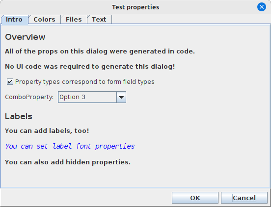
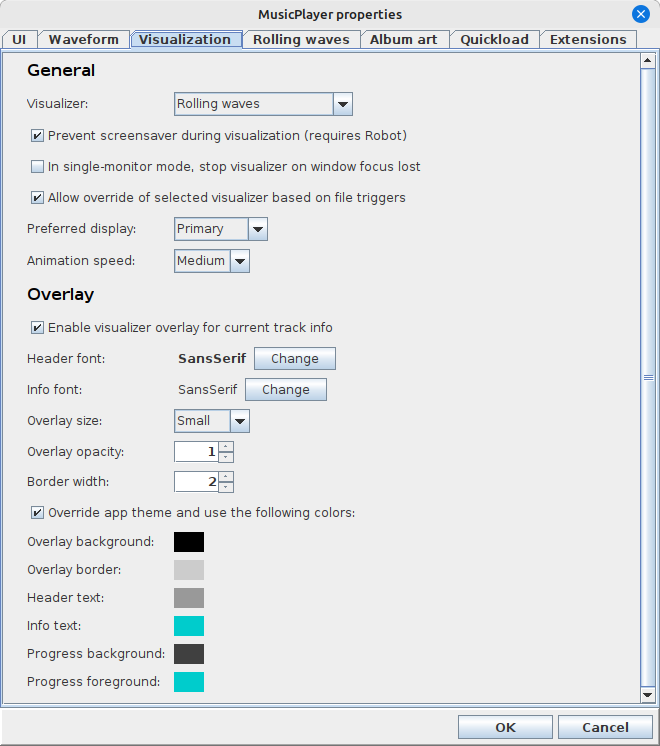

# PropertiesDialog

There's a pair of very powerful classes hiding in the `ca.corbett.extras.properties` package, and they
go very well together. They are `PropertiesManager` and `PropertiesDialog`. These two classes can
save you a LOT of coding.

Let's imagine we want to generate a properties form that looks like this:



How much UI code would we need to write? Would you have guess "absolutely none"? 

## PropertiesManager, and naming properties carefully

Let's start by looking at how we would define the properties for the above properties form:

```java
List<AbstractProperty> props = new ArrayList<>();

// Simple label properties don't allow user input.
// But, they can be handy for organizing and explaining the input form.
props.add(new LabelProperty("Intro.Overview.label1", "All of the props on this dialog were generated in code."));
props.add(new LabelProperty("Intro.Overview.label2", "No UI code was required to generate this dialog!"));

// The available property types correspond to form field types in swing-forms!
// That means we can do checkboxes and combo boxes and all the usual stuff:
props.add(new BooleanProperty("Intro.Overview.checkbox1", "Property types correspond to form field types"));
List<String> options = new ArrayList<>();
options.add("Option 1");
options.add("Option 2 (default)");
options.add("Option 3");
props.add(new ComboProperty<>("Intro.Overview.combo1", "ComboProperty:", options, 1, false));

// Label styling options are available:
props.add(new LabelProperty("Intro.Labels.someLabelProperty", "You can add labels, too!"));
LabelProperty testLabel = new LabelProperty("Intro.Labels.someLabelProperty2", "You can set label font properties");
testLabel.setFont(new Font("Monospaced", Font.ITALIC, 14));
testLabel.setColor(Color.BLUE);
props.add(testLabel);
props.add(new LabelProperty("Intro.Labels.label3", "You can also add hidden properties."));

// Color properties can accept solid colors, color gradients, or both:
props.add(new ColorProperty("Colors.someSolidColor", "Solid color:", ColorSelectionType.SOLID).setSolidColor(Color.RED));
props.add(new ColorProperty("Colors.someGradient", "Gradient:", ColorSelectionType.GRADIENT));
props.add(new ColorProperty("Colors.someMultiColor", "Both:", ColorSelectionType.EITHER));

// File properties can accept directories or files:
props.add(new DirectoryProperty("Files.someDirProperty", "Directory:"));
props.add(new FileProperty("Files.someFileProperty", "File:"));

// Text properties can be single-line or multi-line:
props.add(new ShortTextProperty("Text.Single line.someTextProp1", "Text property1:", "hello"));
props.add(new ShortTextProperty("Text.Single line.someTextProp2", "Text property2:", ""));
props.add(LongTextProperty.ofFixedSizeMultiLine("Text.Multi line.someMultiLineTextProp", "Text entry:", 4, 40)
                          .setValue("You can support long text as well.\n\nPop-out editing is optional.")
                          .setAllowPopoutEditing(true));

// Properties can be "hidden".
// They are readable and settable by the client application.
// But they won't appear in the properties dialog!
// This is great for application state like window size/dimensions and etc.
IntegerProperty hiddenProp = new IntegerProperty("Hidden.someHiddenProp", "hiddenProp", 77);
hiddenProp.setExposed(false);
props.add(hiddenProp);
```

Okay, so far so good. But why do these properties have such long internal names? Let's take a quick
look at the `fullyQualifiedName` of our properties:

### AbstractProperty.fullyQualifiedName

The format of this fully qualified name is as follows:

`[category.[subcategory.]]propertyName`

If category name is not specified, a default name of "General" will be used.    
If subcategory is not specified, a default name of "General" will be used

Some examples:

- **UI.windowState** creates a property called "windowState" belonging to an
  implied subcategory of "General" within the "UI" category.
- **UI.window.state** creates a property called "state" in the subcategory
  of "window" within the top-level category of "UI".
- **windowState** - creates a property called "windowState" in an implied
  top-level category of "General" with an implied subcategory of "General"
- **UI.window.state.isMaximized** - creates a property called "state.isMaximized"
  within the "window" subcategory in the "UI" top-level category. Note that further
  dots after the second one are basically ignored and are considered part of the
  property name. So, you can't have sub-sub-categories.

So, let's look a little closer at one of the properties we created earlier:

```java
new LabelProperty("Intro.Overview.label1", "All of the props on this dialog were generated in code.");
```

This creates a top-level category called "Intro" and a subcategory called "Overview".
The actual field name is called `label1`.

Okay, this seems like a long way to go just to uniquely identify each property. What purpose
do these top-level and subcategory names serve?

### Generating a PropertiesDialog

The `PropertiesManager` class has a method called `generateDialog()` that will return an
instance of `PropertiesDialog`. The beautiful part of all of this is that, because `PropertiesManager`
knows all about our properties, and because each property knows how to generate a `FormField`
from itself, we actually don't need to write a single line of UI code to generate the
`PropertiesDialog`. Our `PropertiesManager` can not only create a dialog for us, but it 
can handle creating all the `FormPanel` and `FormField` instances that it needs.

Referring to our screenshot at the top of this page, you can see how the top-level categories
in our fully qualified names were turned into tab headers, and the subcategory names were
used to generate section header labels. The forms organize themselves and we don't have to
lay out a single UI element!

## A real-world example: musicplayer

For an example of what's possible with these properties classes in `swing-extras`, I refer you
to my own [musicplayer application](https://github.com/scorbo2/musicplayer):



This entire dialog was generated using mechanisms similar to that described above (but not exactly
the same... we'll discuss this more in a later section about application extensions). Absolutely
no UI code was required in the `musicplayer` application itself! The `PropertiesManager` and
`PropertiesDialog` class manage it all! And, the application code doesn't have to worry about
saving or loading these properties, because each property intrinsically knows how to save
and load itself, and `PropertiesManager` can wrap that up for you as well!
