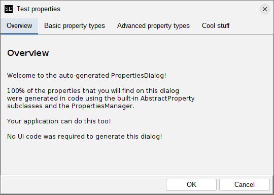
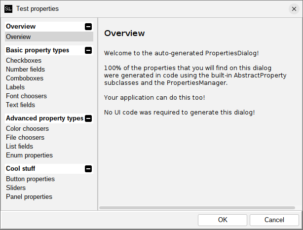

# Tabs versus ActionPanel

Starting in the 2.8 release, the PropertiesDialog by default now uses the new [ActionPanel](../actionpanel/README.md) 
component for navigation, instead of a tab pane. This is a significant change in the user interface, 
and may affect how you decide to lay out your properties.

## The "classic" style (tabbed pane)

This style is still available, via the `createClassicDialog()` method in `PropertiesDialog`, or via
the `generateClassicDialog()` wrapper method in `PropertiesManager`. It looks like this:



If your application uses the application extension mechanism provided by `swing-extras`, you will have
to override the `showPropertiesDialog()` method in your `AppProperties` implementing class, and
invoked `generateClassicDialog()` instead of `generateDialog()`, to get this style of dialog.

## The new ActionPanel style

The new default style uses the `ActionPanel` component for navigation, and looks like this:



This groups actions into action groups, which are expandable and collapsible, in the left-hand pane.
Clicking a property group will show the properties in that group on the right side. This new style
is better suited for applications that have larger numbers of properties, and/or more properties
supplied by extensions, as it allows for better organization and easier navigation. 
It also provides a large number of customization and styling options.

## Customizing the generated dialog

If you are using `AppProperties` in your application, you can override the `propertiesDialogCreated()` method
to get a chance to inspect and modify the generated dialog after it is created but before it is shown.
For example:

```java
@Override
protected void propertiesDialogCreated(PropertiesDialog dialog) {
    // We can customize the ActionPanel!
    if (dialog instanceof ActionPanelPropertiesDialog actionPanelDialog) {
        ActionPanel actionPanel = actionPanelDialog.getActionPanel();
        
        // There are many options here!
        // Refer to the ActionPanel documentation for details.
        actionPanel.getColorOptions().setFromTheme(ColorTheme.MATRIX);
    }
}
```

