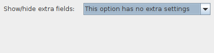
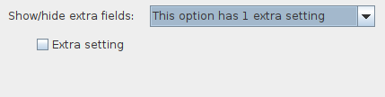
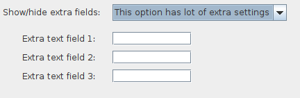

# Form field actions

Often, it is useful to be able to perform some Action when the value in a
form field changes. For example, to show or hide other form fields depending
on the value in a combo box, or to perform some additional logic as soon
as a field value changes. This is also quite easy to achieve in swing-forms!

Let's start by defining a ComboField that has some basic options:

```java
List<String> options = new ArrayList<>();
options.add("This option has no extra settings");
options.add("This option has 1 extra setting");
options.add("This option has log of extra settings");

ComboField comboField = new ComboField("Show/hide extra fields:", options, 0, false);
formPanel.addFormField(comboField);
```

Then we can define some extra fields and hide them by default:

```java
CheckBoxField extraField1 = new CheckBoxField("Extra setting", false);
extraField1.setVisible(false);
formPanel.addFormField(extraField1);

TextField extraField2 = new TextField("Extra text field 1:", 10, 1, true);
extraField2.setVisible(false);
formPanel.addFormField(extraField2);

TextField extraField3 = new TextField("Extra text field 2:", 10, 1, true);
extraField3.setVisible(false);
formPanel.addFormField(extraField3);

TextField extraField4 = new TextField("Extra text field 3:", 10, 1, true);
extraField4.setVisible(false);
formPanel.addFormField(extraField4);
```

Now, we can add a custom Action onto our ComboField to show or hide the
extra fields depending on which combo option is selected:

```java
comboField.addValueChangedAction(new AbstractAction() {
    @Override
    public void actionPerformed (ActionEvent e){
        int selectedIndex = mainComboField.getSelectedIndex();
        extraField1.setVisible(selectedIndex == 1);
        extraField2.setVisible(selectedIndex == 2);
        extraField3.setVisible(selectedIndex == 2);
        extraField4.setVisible(selectedIndex == 2);
    }
});
```

The end result is that the "extra" fields will be shown or hidden as needed
at runtime, based on what you pick in the dropdown:





Above we see the difference between selecting the different combo options.
The "extra" fields that we have defined appear or disappear based on our
combo box selection. We can simply use the FormField's setVisible() method
in our custom Action to accomplish this!

## Other uses for custom actions

We can hook a custom action onto almost any form field, in order to drive behaviour elsewhere
on the form. Common uses of this are:

- Showing/hiding components depending on input (as shown above)
- Enabling/disabling components depending on input
- Pre-filling fields based on the values in other fields
- Loading additional options or data as values are selected

With an action wired up to every field on a form, you could even build a "live update" control
panel that does not require an "OK" or "Submit" button, but which rather updates something elsewhere
in your application as soon as the user makes a selection. 
