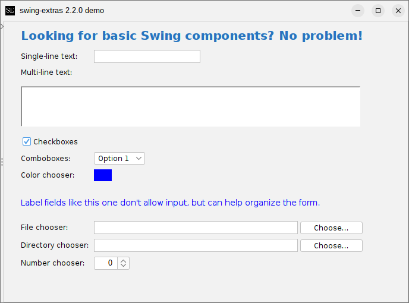

# swing-forms: the basics



Most of the common Swing components are wrapped in `swing-forms` so that you can very quickly stand
up an input form without writing any UI code. In the screenshot above, we can see examples of some
of the more basic form fields. This requires comparatively MUCH less code than trying to lay everything
out with `GridBagLayout`.

## Example code for a simple text input

The code to generate a form with a simple text input field is quite simple:

```java
FormPanel formPanel = new FormPanel();
formPanel.addFormField(new TextField("Label:", 15, 1, true));
formPanel.render();
```

The TextField constructor takes the following parameters:

- Text to show in the field label
- Number of character columns for the text field (field width)
- Number of character rows for the text field (1 for single-line input)
- Whether the field should allow blank values or not

Once the TextField has been created, it can be added to a FormPanel via the
addFormField() method. And you don't have to write any manual layout code!

## Retrieving field values

Of course, just adding a new field to a `FormPanel` won't help you retrieve the
value of it once the form is submitted. For this purpose, you can either add an
action to the form field using `addValueChangedAction()` to listen for updates
on the text field itself, or you can query for the field later by giving it
a unique identifier. 

### Listening for change events on the field

Let's say we want to receive updates as the user enters text on the field.
We can do this by supplying a custom `AbstractAction` to the field:

```java
final TextField textField = new TextField("Enter some text:", 12, 1, true);
textField.addValueChangedAction(new AbstractAction() {
    @Override
    public void actionPerformed(ActionEvent e) {
        String currentValue = textField.getText();
        // Do something with the current value...
    }
});
```

The drawback of this approach is that our action will be triggered every time the user
adds, deletes, or edits text within the field, even before the form has been submitted.
We likely don't want to do this (although there are many scenarios where listening
to the form field for changes can be useful, as we will cover in the [Actions section](Actions.md) later).
What we likely want to do instead is to retrieve the value of the text field AFTER the 
user has hit the OK or Submit button.

### Retrieving a specific field from a FormPanel

We do this by setting a unique identifier for the field when we create it. We can then
query the `FormPanel` for this field later:

```java
TextField textField = new TextField("Enter some text:", 12, 1, true);
textField.setIdentifier("textField");
formPanel.addFormField(textField);
```

Then, later, when the form is submitted, we can find that field:

```java
TextField textField = (TextField)formPanel.getFormField("textField");
String value = textField.getText();
// do something with the value
```

### There's an even easier way...

Later, when we discuss Properties, we'll find that there's an even easier
way of retrieving the values from submitted forms, without having to talk to the `FormPanel` or
any of the form fields directly.

But first, let's continue covering the basics provided by `swing-forms`...
