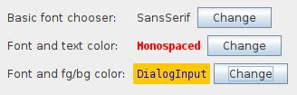
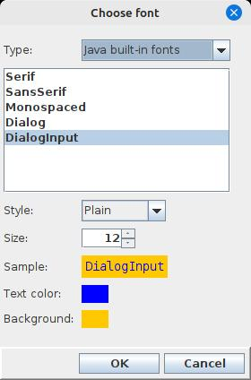
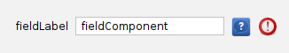
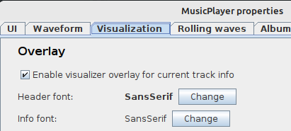

# Custom form fields

The included example FormField implementations will cover the most basic form
input requirements. But inevitably, you may require some new type of FormField
to capture data that the built-in FormFields simply can't. Fortunately, `swing-forms`
is built with extensibility in mind. The abstract `FormField` class can fairly easily
be extended to create a new field type.

## Custom form field walkthrough - let's build a Font chooser

Let's walk through the process of building a `FontField` form field that allows
the user to choose a font, along with style parameters like bold or italics,
and also optional foreground/background color selection. Can we create such
a field with `swing-forms`? Yes we can!

 

We start by extending the FormField class and adding all the class properties that
we will need:

```java
public final class FontField extends FormField {

    private final JLabel sampleLabel;
    private final JButton button;
    private final JPanel wrapperPanel;
    private ActionListener actionListener;
    private Font selectedFont;
    private Color textColor;
    private Color bgColor;
    // ...
}
```

We can add some overloaded constructors to allow optionally setting an initial font, and optionally
specifying a starting text color and background color. If the color properties aren't specified,
we'll omit them from our font dialog and those properties won't be editable.

We also need to create our font chooser popup dialog. This is actually fairly easy because it
is in fact just another FormPanel! We can use existing FormFields to create it, such as ComboField,
ListField, and LabelField. 

Okay, so we have an empty Font list... how do we populate it with the list of fonts?

```java
switch (typeField.getSelectedIndex()) {
    case 0: // built-in fonts
      fontListModel.addAll(List.of(Font.SERIF, Font.SANS_SERIF, Font.MONOSPACED, Font.DIALOG, Font.DIALOG_INPUT));
      // ...
      break;
      
    case 1: // System fonts
      fontListModel.addAll(Arrays.asList(GraphicsEnvironment.getLocalGraphicsEnvironment().getAvailableFontFamilyNames()));
      // ...
      break;
}
```

The Java built-in fonts are those guaranteed to use by the JRE. These are the "safe" fonts
that we can simply hard-code here with assurance from Java that they will resolve to actual
system fonts at runtime.

The system-installed fonts we can retrieve from the local graphics environment. This list may
vary greatly from system to system and is beyond our control, but we can enumerate them
and present them to our users in the font list field.

### Setting the field component

The next important step when creating a custom FormField implementation is to set something
called the `fieldComponent`. Let's look at part of the constructor of our FontField:

```java
//...
wrapperPanel = new JPanel();
wrapperPanel.setLayout(new FlowLayout(FlowLayout.LEFT));
sampleLabel = new JLabel();
sampleLabel.setOpaque(true);
sampleLabel.setBorder(BorderFactory.createEmptyBorder(4, 4, 4, 4));
updateSampleLabel();
fieldComponent = wrapperPanel;
wrapperPanel.add(sampleLabel);
wrapperPanel.add(button);
//...
```

We create a `wrapperPanel` and add both our sample label to it, and also our JButton for launching the font
selection dialog. Then, this wrapper panel is set as our field component:

```java
fieldComponent = wrapperPanel;
```

#### Anatomy of a FormField

There are four main components within every FormField:

1. The field label (optional in some components).
2. The field component - this is the key part of the FormField.
3. The help label (optional - only shown if help text is available)
4. The validation label (optional - only shown when the form is validated)

We can see these pieces in the screenshot below:



When we create a custom FormField, we'll typically set the user-interactable component as our `fieldComponent`.
But what if we require more than one UI component in our form field?

Now we can see why our `FontField` implementation creates a wrapperPanel and adds more than one UI element
to it. It's because the `FormField` parent class expects a single `fieldComponent`. Using a wrapper panel
to group several UI components together into one `fieldComponent` can be a great way to develop complex,
multi-component FormFields.

### Allowing callers to listen for changes

When designing a new `FormField` implementation, we should publish change events whenever the
content of our field has been modified. This allows callers to respond to those change events
if needed. In our case, we need to notify callers whenever one of our properties changes:
the selected font, the selected font color, or the selected font background color. How
do we do this? Fortunately, the parent `FormField` class makes this easy for us! It gives 
us a `fireValueChangedEvent()` method that we can invoke whenever we detect any change. This
method handles notifying all listeners, if any are registered. 

So, we simply need to include this in our setter methods. For example:

```java
public FontField setSelectedFont(Font font) {
    if (Objects.equals(selectedFont, font)) {
        return this; // don't accept no-op changes
    }
    selectedFont = font;
    updateSampleLabel();
    fireValueChangedEvent();
    return this;
}
```

We first check to make sure that the call to `setSelectedFont()` will actually result in a change.
(That is, if you invoke `setSelectedFont()` with the same font that is already selected, nothing happens).
Next, we accept the new font, update our sample label, and invoke `fireValueChangedEvent()` in the parent
class to notify any listeners. Finally, we return `this` to allow for fluent-style method chaining, as
we do with all our setter methods.


## It's not just a documentation example

The `FontField` form field that we've built above is not just a theoretical example that
was cooked up for this documentation. It actually works! The full source is included
in the `swing-extras` library and you can use it in your applications. Here's an example
of it being used in the [musicplayer application](https://github.com/scorbo2/musicplayer):



