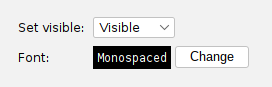
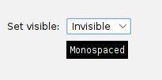
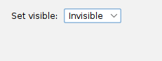

# Custom form fields

The included example FormField implementations will cover the most basic form
input requirements. But inevitably, you may require some new type of FormField
to capture data that the built-in FormFields simply can't. Fortunately, `swing-forms`
is built with extensibility in mind. The abstract `FormField` class can fairly easily
be extended to create a new field type.

## Custom form field walkthrough - let's build a Font chooser

Let's walk through the process of building a `FontField` form field that allows
the user to choose a font, along with style parameters like bold or italics,
and also optional foreground/background color selection. Can we create such
a field with `swing-forms`? Yes we can!

 

We start by extending the FormField class and adding all the class properties that
we will need:

```java
public final class FontField extends FormField {

    private final JLabel sampleLabel;
    private final JButton button;
    private ActionListener actionListener;
    private Font selectedFont;
    private Color textColor;
    private Color bgColor;
    // ...
}
```

We can add some overloaded constructors to allow optionally setting an initial font, and optionally
specifying a starting text color and background color. If the color properties aren't specified,
we'll omit them from our font dialog and those properties won't be editable.

We also need to create our font chooser popup dialog. This is actually fairly easy because it
is in fact just another FormPanel! We can mostly use existing FormFields to create it. The exception
is our font family list chooser. We probably don't want to use a combo box here, as the list of
installed system fonts might be quite large. It's easier to use a JList for this purpose, but we
currently don't have a FormField that wraps JList, so we have to write some manual code here.
Fortunately, it's not too difficult, as we can just wrap it in a PanelField:

```java
// Create and configure a PanelField to house our custom stuff:
PanelField panelField = new PanelField();
JPanel panel = panelField.getPanel();
panel.setLayout(new BorderLayout());

// Create a JList to house the list of available fonts:
fontListModel = new DefaultListModel<>();
fontList = new JList<>(fontListModel);
fontList.setSelectionMode(ListSelectionModel.SINGLE_SELECTION);
fontList.addListSelectionListener(e -> fontChanged());

// Add the font list to our PanelField:
panel.add(new JScrollPane(fontList), BorderLayout.CENTER);

// Add our PanelField to our FormPanel:
formPanel.addFormField(panelField);
```

This is in fact why PanelField was created in the first place - to provide a way to wrap and house
any arbitrary UI components that aren't currently wrapped up in their own FormField implementation.

Okay, so we have an empty JList... how do we populate it with the list of fonts?

```java
switch (typeField.getSelectedIndex()) {
    case 0: // built-in fonts
      fontListModel.addAll(List.of(Font.SERIF, Font.SANS_SERIF, Font.MONOSPACED, Font.DIALOG, Font.DIALOG_INPUT));
      // ...
      break;
      
    case 1: // System fonts
      fontListModel.addAll(Arrays.asList(GraphicsEnvironment.getLocalGraphicsEnvironment().getAvailableFontFamilyNames()));
      // ...
      break;
}
```

The Java built-in fonts are those guaranteed to use by the JRE. These are the "safe" fonts.
The system-installed fonts we can retrieve from the local graphics environment. This list may
vary greatly from system to system and is beyond our control.

The next important step is to implement the render() method so that the field can draw itself.
Unfortunately, here we have to deal with GridBagLayout a little bit. But, swing-forms tries
to minimize this exposure by handing your method a GridBagConstraints object that you can
use as you go. Here's our render() method:

```java
@Override
public void render(JPanel container, GridBagConstraints constraints) {
  constraints.insets = new Insets(topMargin, leftMargin, bottomMargin, componentSpacing);
  constraints.gridy++;
  constraints.gridx = FormPanel.LABEL_COLUMN;
  fieldLabel.setFont(fieldLabelFont);
  container.add(fieldLabel, constraints);

  constraints.gridx = FormPanel.CONTROL_COLUMN;
  button.setPreferredSize(new Dimension(95, 23));
  button.setFont(selectedFont.deriveFont(12f));
  
  JPanel wrapperPanel = new JPanel();
  wrapperPanel.setBackground(container.getBackground());
  wrapperPanel.setLayout(new BoxLayout(wrapperPanel, BoxLayout.X_AXIS));
  wrapperPanel.add(sampleLabel);
  wrapperPanel.add(new JLabel(" ")); // spacer
  wrapperPanel.add(button);

  if (actionListener != null) {
    button.removeActionListener(actionListener);
  }
  actionListener = getActionListener(container);
  button.addActionListener(actionListener); // UTIL-147 avoid adding it twice

  constraints.fill = 0;
  constraints.insets = new Insets(topMargin, componentSpacing, bottomMargin, componentSpacing);
  container.add(wrapperPanel, constraints);
}
```

It is important to increment the `gridy` property straight away as we are starting a new
row on the form. We can make use of the various `COLUMN` constants provided by the
FormPanel class to control which component goes into which form column. Very basically,
we have a form column for field labels and a form column for the field itself. Behind the
scenes, there are some additional columns, but we rarely need to worry about them in
a FormField's render implementation (but we can if we need to).

We'll notice that the `CONTROL_COLUMN` here simply receives a `wrapperPanel`. What is this?
We don't have a single control to display in this column, but rather we have two - our
sample label and our action button. But our FormPanel only has one column for field controls.
So, we have to wrap our multiple controls into one containing panel, and then add that panel
in the `CONTROL_COLUMN`. This concept of wrapping multiple components into one wrapper
is very handy for wrapping up multiple controls into a single FormField.

We should also look at the ActionListener that we create for our button. It has to launch
our FontDialog and update our field values as needed, based on what the user picked.
Here we can also make use of the `fireValueChangedEvent()` method in the parent class:

```java
/**
 * Creates and returns a new ActionListener suitable for our form field.
 *
 * @param panel The owning panel (used to position the popup dialog)
 * @return An ActionListener that can be attached to a button.
 */
private ActionListener getActionListener(final JPanel panel) {
  return new ActionListener() {
    @Override
    public void actionPerformed(ActionEvent e) {
      FontDialog dialog = new FontDialog(panel, selectedFont, textColor, bgColor);
      dialog.setVisible(true);
      if (dialog.wasOkayed()) {
        setSelectedFont(dialog.getSelectedFont());
        setTextColor(dialog.getSelectedTextColor());
        setBgColor(dialog.getSelectedBgColor());
        fireValueChangedEvent();
      }
    }
  };
}
```

Triggering a value changed event will allow swing-forms to invoke any custom
Actions that have been registered on our custom form field. This allows other fields
to respond if they want to, based on whatever font the user has selected here.

## Controlling visibility

Just for fun, let's wire up a `FontField` to a control that lets us toggle its visibility on or off:



When we toggle the field to be invisible, we expect the `FontField` will be hidden. Right? Let's try it:



What happened? It looks like only the field label and the button were hidden, while the example font display
remained visible! What happened is that we didn't override the `setVisible` method from `FormField`. 
Let's do that now:

```java
@Override
public void setVisible(boolean isVisible) {
    super.setVisible(isVisible);
    wrapperPanel.setVisible(isVisible);
}
```

The parent class does not know about our `wrapperPanel`, so we have to remember to toggle its visibility
whenever the field's visibility changes. Let's try it again with this change in place:



Much better! Another method that you might have to override in your custom `FormField` is the `setEnabled`
method, for the same reason - if your custom field contains extra controls that the parent class doesn't know
about, they will not be enabled or disabled when the field is enabled or disabled. In the case of `FontField`,
we don't have to worry about that, because our sample font display label is read-only and so cannot be disabled.

## It's not just a documentation example

The `FontField` form field that we've built above is not just a theoretical example that
was cooked up for this documentation. It actually works! The full source is included
in the `swing-extras` library and you can use it in your applications. Here's an example
of it being used in the [musicplayer application](https://github.com/scorbo2/musicplayer):


