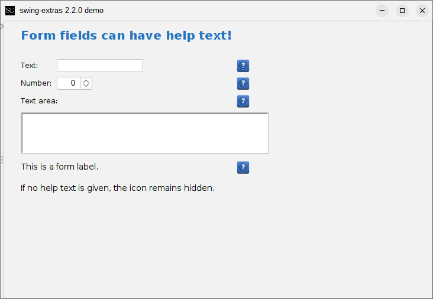
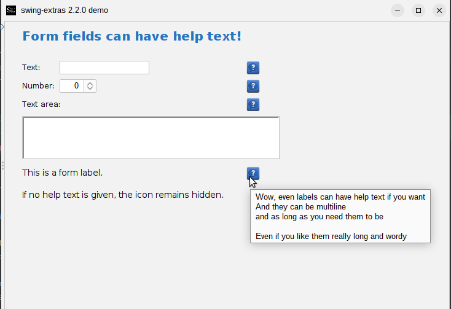

# Help tooltips

Most `FormField` implementations (including your own custom ones, if you want) support
the concept of a helpful informational tooltip that can be displayed next to the field.
It looks like this:



To enable this, you can invoke `setHelpText()` on the field in question and supply
some non-blank value (setting `null` or an empty string will disable the tooltip and
prevent the information icon from appearing).

```java
TextField textField = new TextField("Text:", 12, 1, true);
textField.setHelpText("Help icons show up whenever a field has help text");
panel.addFormField(textField);
```

When the user hovers the mouse over the informational icon, the tooltip appears:



To support this in custom form field implementations, you don't actually have to do
anything at all, as the code for this is handled by the abstract `FormField` class
and by the `FormPanel` class (which handles the rendering of the icon). The only
time your custom code might need to override the default behaviour is if the layout
of your custom field requires special handling. In that case, you can set the
`isExtraLabelRenderedByField` to `true` in your custom code. This tells `FormPanel`
not to render the "extra" labels (tooltip label and form validation label), because
your custom code will handle this in your `render()` method.

For an example of this, see the implementation of the multi-line `TextField`.
Because that component potentially spans multiple form rows, the `TextField.render()`
method had to render both the tooltip icon (if help text is present) and the
form validation icon.
