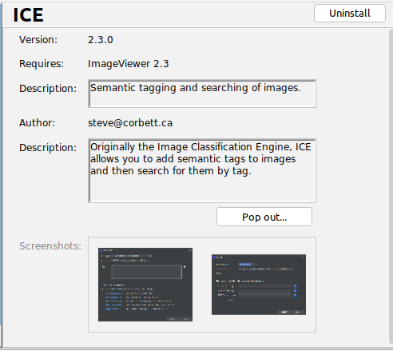
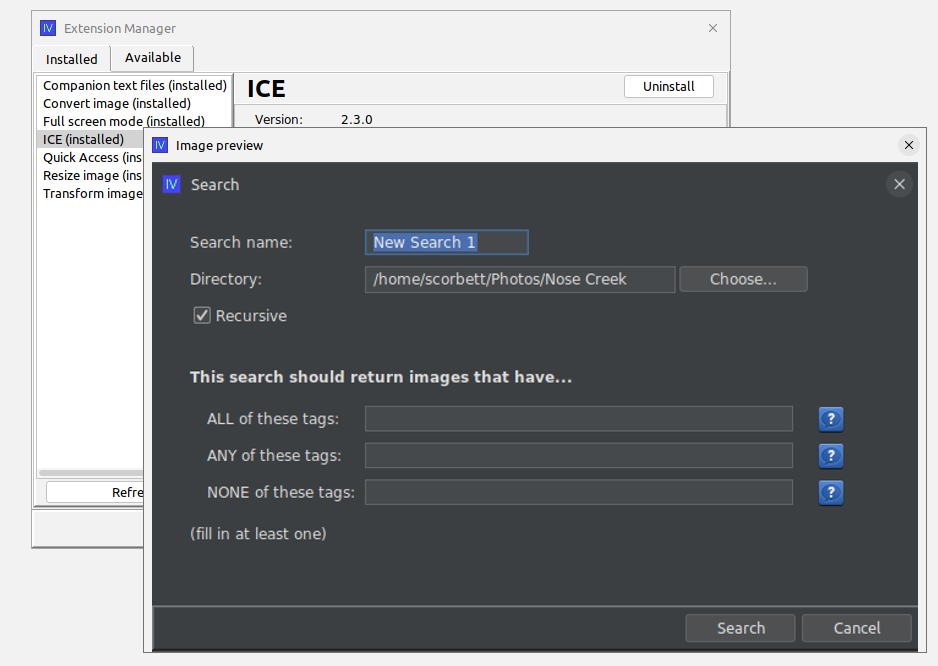

# Image lists

New in the 2.5 release of swing-extras is the `ImageListField` component, which allows users to view
or manipulate a list of images. For an example of how this field can be used, consider the 
extension manager dialog in the [ImageViewer](https://github.com/scorbo2/imageviewer/) application:



Here we see the "screenshots" field at the bottom of the form shows two thumbnails of screenshots
that we can view for this extension. When we double-click one of these thumbnails, we see the 
screenshot load in a popup window:



## Setting an initial selection of images in the field

Creating an `ImageListField` and giving it some initial images is fairly straightforward:

```java
ImageListField imageListField = new ImageListField("Image list:", 5, 75);
imageListField.addImage(image1);
imageListField.addImage(image2);
imageListField.addImage(image3);

// We can add a help icon to this field as its usage may not be intuitive at first glance:
imageListField.setHelpText("<html><b>USAGE:</b><br>Try double-clicking the images in the image list!"
                      + "<br>Click and drag left/right to scroll the list!"
                      + "<br>You can drag and drop images from your file system onto the list!</html>");

// Tell the list to fill the width of the form panel:
imageListField.setShouldExpand(true); 

// We can optionally set an owner window for ownership of the popup preview:
imageListField.getImageListPanel().setOwnerWindow(myMainWindow);
```
The last parameter to the constructor are the desired (square) dimensions of the image thumbnails.
Any pixel value from 25 to 500 is accepted here, and the images added to the list will automatically
be scaled to fit the desired dimensions. If there are too many thumbnails to display them all in the
list simultaneously, a scrollbar will be provided, and the user can either manipulate the scrollbar,
or click and drag left/right on any of the thumbnails to scroll the list. Double-clicking a thumbnail
will open that image in a resizable preview window.

## Removing images

Right-clicking any thumbnail will bring up a popup menu with a "remove" item. Selecting that menu
item will remove the given image from the list.

## Drag and drop

Yes, users can add new images to the list via drag and drop from the filesystem! This is enabled
out of the box and no extra code is required to support this.

## Preventing modification of the list

You can optionally "freeze" the list, preventing modifications to it. The user can still scroll
left or right to vew thumbnails, and can still double-click to preview images, but can no longer
drag new images onto the list, and can no longer right-click to remove images from the list.

```java
imageListField.setEnabled(false); // prevent modification
```
