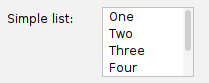
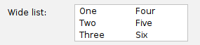
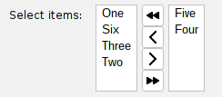
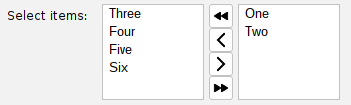

# List fields

The `ListField` class provides an easy wrapper around a Swing `JList` component, allowing
you to quickly add a multi-select list field to your form. Setting up a ListField is as
easy as providing the list of items:

```java
// Create a simple ListField with a default vertical list:
List<String> options = List.of("One","Two","Three","Four","Five","Six");
ListField<String> listField = new ListField<>("Simple list:", options);
listField.setFixedCellWidth(80); // We can optionally control the width of each list cell
listField.setVisibleRowCount(4); // And also how many rows are displayed
formPanel.add(listField);
```

This results in a simple multi-select list field in the form:



Horizontal lists are also supported, by using the `setLayoutOrientation()` method:

```java
ListField<String> listField = new ListField<>("Wide list:", options);
listField.setLayoutOrientation(JList.VERTICAL_WRAP);
listField.setFixedCellWidth(80);
listField.setVisibleRowCount(3);
formPanel.add(listField);
```

That results in a wide horizontal list field:



The list selection mode can be configured via the `setSelectionMode()` method, which takes
the usual Swing `ListSelectionModel` constants:

```java
// Only allow one item to be selected at a time:
listField.setSelectionMode(ListSelectionModel.SINGLE_SELECTION);

// Allow multiple contiguous items to be selected:
listField.setSelectionMode(ListSelectionModel.SINGLE_INTERVAL_SELECTION);

// Allow any arbitrary combination of items to be selected:
listField.setSelectionMode(ListSelectionModel.MULTIPLE_INTERVAL_SELECTION);
```

The selected items can be retrieved via the `getSelectedValues()` method, which returns a list of the selected items:

```java
List<String> selectedItems = listField.getSelectedValues();
for (String item : selectedItems) {
    System.out.println("Selected item: " + item);
}
```

## ListField is a typed class!

You are not limited to String values for your list items. ListField is a generic typed class, so you can
use any object type you want for your list items. Just make sure that the object type you use has a
meaningful `toString()` method, since that is what will be displayed in the list.
For example, you could create a simple `Person` class and use it in a ListField:

```java
public class Person {
    private String name;
    public Person(String name) { this.name = name; }
    @Override
    public String toString() { return name; }
}
List<Person> people = List.of(new Person("Alice"), new Person("Bob"), new Person("Charlie"));
ListField<Person> peopleListField = new ListField<>("Select people:", people);
formPanel.add(peopleListField);
```

## An alternative option: ListSubsetField

There's another option in swing-extras for list selection: the `ListSubsetField` class.
This field provides a dual-list interface, where the user can move items between an "available items"
list and a "selected items" list. This is useful when you want to allow users to select items from a large set
without overwhelming them with a single long list. The `ListSubsetField` class provides buttons for adding/removing items
between the two lists, and it handles all the necessary logic for you. Setting up a ListSubsetField is similar to ListField:

```java
// Create our list of items:
List<String> options = List.of("One","Two","Three","Four","Five","Six");
ListSubsetField<String> subsetField = new ListSubsetField<>("Select items:", options);

// We can pre-select a few items by their list index, if we want:
subsetField.selectIndexes(new int[] {0, 1}); // Select "One" and Two"

formPanel.add(subsetField);
```

This results in a dual-list field in the form:



But wait! Why are the lists so narrow? By default, each list will only be as wide as needed to display
its items. We can control the initial width of each list by using the `setFixedCellWidth()` method:

```java
subsetField.setFixedCellWidth(100); // Set each list to be 100 pixels wide
```

Now, our list field looks much better:



The selected items can be retrieved via the `getSelectedValues()` method, just like with ListField,
and the ListSubsetField class is also a typed generic class, so you can use any object type you want for your list items.

## Integration with Properties

All of the list field classes in swing-extras have `AbstractProperty` wrappers, which is important
for using them with the properties system, as we will see in later sections of this documentation.
