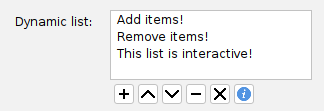
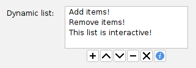
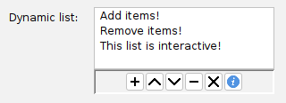
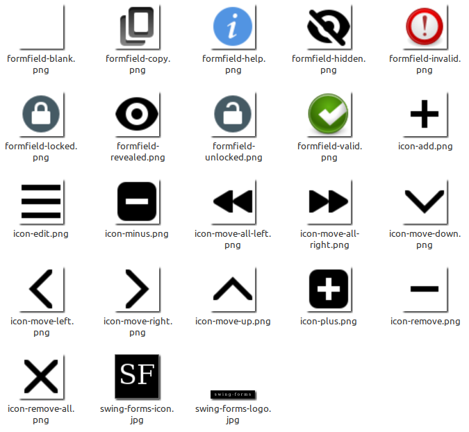

# Adding action buttons to a ListField

A very common use case is to create a `ListField` that allows users to manipulate items
in the list via action buttons, such as "Add", "Remove", "Edit", "Move Up", and "Move Down".
You can of course use a `ListField` followed immediately by a `ButtonField` containing
these actions, but starting in swing-extras 2.7, the `ListField` class now has built-in support
for adding buttons directly to the ListField, and controlling their styling and position!

## An example using built-in Actions

The swing-extras library comes with some pre-built `Action` implementations that you can
very quickly add to your `ListField`. Let's look at an example from the swing-extras demo app:

```java
List<String> initialItems = List.of(
        "Add items!",
        "Remove items!",
        "This list is interactive!"
);

// Create our ListField:
ListField<String> listField = new ListField<>("Dynamic list:", initialItems);
listField.setFixedCellWidth(200);
listField.setVisibleRowCount(4);

// Let's add some Buttons to it!
listField.setButtonPreferredSize(new Dimension(20, 20));
listField.addButton(new ListItemAddAction(listField));
listField.addButton(new ListItemMoveAction<>(listField, ListItemMoveAction.Direction.UP));
listField.addButton(new ListItemMoveAction<>(listField, ListItemMoveAction.Direction.DOWN));
listField.addButton(new ListItemRemoveAction(SwingFormsResources.getRemoveIcon(16), listField));
listField.addButton(new ListItemClearAction(SwingFormsResources.getRemoveAllIcon(16), listField));
listField.addButton(new ListItemHelpAction());
```

By default, buttons are aligned to the left, and appear underneath the list, like this:



That looks okay, but the buttons are spaced a little too far apart, and the left-alignment just
doesn't look quite right. Can we fix it? Of course!

## Customizing button alignment and position

```java
// Center the buttons and tighten up the spacing:
listField.setButtonLayout(FlowLayout.CENTER, 2, 2);
```

That gives us the following result:



Better, but it still feels like it's missing something. Maybe we could add a border around
the button panel, to make it visually seem more "attached" to the ListField?

```java
// Add a border around the button panel:
listField.setButtonPanelBorder(BorderFactory.createLoweredBevelBorder());
```

Now we have this:



Much better! Now, it looks like one cohesive UI component.

## Further customization

The button bar can be placed above or below the list (default below, as pictured above). This
can be controlled via the `setButtonPosition()` method:

```java
// Move the button panel above the ListField:
listField.setButtonPosition(ListField.ButtonPosition.TOP);
```

In our example above, we used buttons with icons, but of course you can also use text-based
buttons, if you prefer.

## Built-in actions supplied by swing-extras

Let's take a quick tour of the actions that are provided out-of-the-box by swing-extras:

- `ListItemClearAction` - Clears all items from the list.
- `ListItemRemoveAction` - Removes the selected item(s) from the list.
- `ListItemMoveAction` - Moves the selected item(s) up or down in the list.
- `ListItemSelectAllAction` - Selects all items in the list.

### Wait, where is ListItemAddAction?

The `ListItemAddAction` class is not included in the main swing-extras library, because adding
items to a list usually requires some custom UI to gather the new item data from the user.
The library doesn't know what kind of items you have in your list, or how to create a new one!

However, the demo application that comes with swing-extras includes an example implementation
of `ListItemAddAction` that you can refer to when implementing your own "Add item" action for
your `ListField`. It looks like this:

```java
/**
 * Adding a list item is one of the actions that we can't supply 
 * out-of-the-box, because we don't know what type of data the 
 * list holds or what the list represents. So, here's a simple 
 * example action that prompts the user for a simple string value
 * and adds it to the list.
 */
private static class ListItemAddAction extends EnhancedAction {

    private final ListField<String> listField;

    public ListItemAddAction(ListField<String> listField) {
        super(SwingFormsResources.getAddIcon(16));
        this.listField = listField;
        setTooltip("Add new list item");
    }

    @Override
    public void actionPerformed(ActionEvent e) {
        String newItem = JOptionPane.showInputDialog(
                DemoApp.getInstance(), "Enter new item:");
        if (newItem != null && !newItem.trim().isEmpty()) {
            listField.getListModel().addElement(newItem.trim());
        }
    }
}
```

## Built-in icons

The swing-extras library includes a set of built-in icons for use with the various list item actions.
These icons are available via the `SwingFormsResources` utility class, for example:



_Attribution: these icons are from the [Adwaita icon set](https://github.com/GNOME/adwaita-icon-theme) 
by the [GNOME project](http://www.gnome.org)._

They are easily accessible via the `SwingFormsResources` class, as shown in the above code example.
You can specify a pixel size when retrieving the icons, to scale them to fit your buttons:

```java
public ListItemAddAction(ListField<String> listField) {
    
    // Retrieve the "Add" icon at 16x16 pixels:
    super(SwingFormsResources.getAddIcon(16));
    
    // ...
}
```
