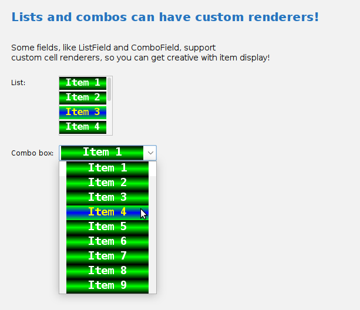

# List rendering

Both 'ListField' and 'ComboField' support custom cell renderers, if the items you are displaying are more
than mere String values, or if the items in your list require some custom rendering.

For a particularly ugly example of this powerful feature, consider this screenshot:



Here we see simple String items being rendered with a custom cell renderer that gives each item a gradient
background that varies depending on whether the item is selected or not. The font for each item also
varies depending on item selection status.

That example is pretty visually horrible, but it does give you an idea of what you can accomplish with the
`setCellRenderer()` method. The above screenshot was generated with this code:

```java
List<String> items = List.of("Item 1", "Item 2", "Item 3", "Item 4",
                             "Item 5", "Item 6", "Item 7", "Item 8",
                             "Item 9");

ListField<String> listField = new ListField<>("List:", items);
listField.setFixedCellWidth(80);
listField.setCellRenderer(new Renderer(90,25));
listField.setVisibleRowCount(4);
listField.getMargins().setBottom(12);
formPanel.add(listField);

ComboField<String> comboField = new ComboField<>("Combo box:", items, 0);
comboField.setCellRenderer(new MyAwfulRenderer(140, 25));
formPanel.add(comboField);
```

And the implementation of the `MyAwfulRenderer` is pretty straightforward:

```java
private static class Renderer implements ListCellRenderer<String> {

    private final Map<String, ImagePanel> unselectedCells = new HashMap<>();
    private final Map<String, ImagePanel> selectedCells = new HashMap<>();

    private final int cellWidth;
    private final int cellHeight;

    public Renderer(int width, int height) {
        cellWidth = width;
        cellHeight = height;
    }

    @Override
    public Component getListCellRendererComponent(JList<? extends String> list, String value, int index, boolean isSelected, boolean cellHasFocus) {
        ImagePanel iPanel = isSelected ? selectedCells.get(value) : unselectedCells.get(value);
        if (iPanel == null) {
            iPanel = createImagePanel(value, isSelected);
        }
        return iPanel;
    }

    private ImagePanel createImagePanel(String value, boolean isSelected) {
        ImagePanel panel = new ImagePanel(ImagePanelConfig.createSimpleReadOnlyProperties());
        panel.stretchImage();

        Gradient gradient = new Gradient(GradientType.HORIZONTAL_STRIPE,
                                         isSelected ? Color.GREEN : Color.BLACK,
                                         isSelected ? Color.BLUE : Color.GREEN);

        LogoProperty config = new LogoProperty(value);
        config.setLogoWidth(cellWidth);
        config.setLogoHeight(cellHeight);
        config.setBgColorType(LogoProperty.ColorType.GRADIENT);
        config.setBgGradient(gradient);
        config.setAutoSize(true);
        config.setFont(new Font(Font.MONOSPACED, Font.BOLD, 11));
        config.setTextColor(isSelected ? Color.YELLOW : Color.WHITE);
        config.setBorderWidth(0);
        panel.setImage(LogoGenerator.generateImage(value, config));

        if (isSelected) {
            selectedCells.put(value, panel);
        }
        else {
            unselectedCells.put(value, panel);
        }

        panel.setPreferredSize(new Dimension(cellWidth, cellHeight));

        return panel;
    }
}
```

Basically, it lazily creates the image for each cell based on selection status, and then uses a pair of
HashMaps to cache the generated images for later retrieval. 

This example is admittedly ugly, but the point of it is that you can supply whatever renderer you can think
up for rendering your list items. Hopefully with help from a good graphic designer! :)
