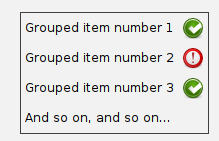
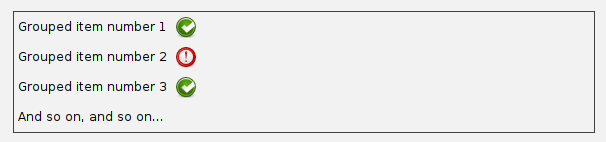
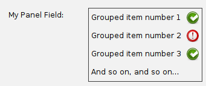
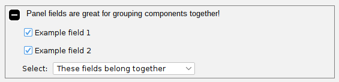
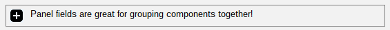
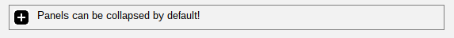
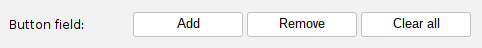
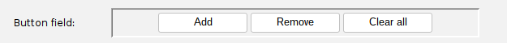

# Panel fields

Recall from the section on [custom fields](CustomFields.md) that we discussed the anatomy of a FormField:

1. The field label (optional in some components).
2. The field component - this is the key part of the FormField.
3. The help label (optional - only shown if help text is available)
4. The validation label (optional - only shown when the form is validated)

We can see these pieces in the screenshot below:


The field component is typically some singular input component, like a JTextField or a JButton. 
But, what if I need to represent several things all grouped together? 

## Introducing PanelField

`PanelField` is a very simple `FormField` implementation that conceals a very powerful ability:
the ability to group whatever components you want together into a single form field! You can even
add another `FormPanel` into a `PanelField`:

```java
FormPanel formPanel = new FormPanel();

// Create a PanelField for grouping stuff together, and give it a border:
PanelField panelField = new PanelField(new BorderLayout());
panelField.getPanel().setBorder(BorderFactory.createLineBorder(Color.DARK_GRAY, 1));

// Now let's add a whole FormPanel to it! Why not?
FormPanel subForm = new FormPanel(Alignment.TOP_LEFT);
subForm.add(new LabelField("Grouped item number 1").addFieldValidator(new LabelValidator(true)));
subForm.add(new LabelField("Grouped item number 2").addFieldValidator(new LabelValidator(false)));
subForm.add(new LabelField("Grouped item number 3").addFieldValidator(new LabelValidator(true)));
subForm.add(new LabelField("And so on, and so on..."));
subForm.validateForm(); // force our checkmarks and X-marks to show up
panelField.getPanel().add(subForm, BorderLayout.CENTER);

// Now we can add this PanelField just as we would add any regular FormField:
formPanel.add(panelField);
```

The result looks like this:



We also have the option to tell the `PanelField` to expand to consume the entire width of the containing
`FormPanel`:

```java
panelField.setShouldExpand(true);
```

Whether that makes sense or not depends on what we're putting into our PanelField, of course. 
In our above example, we see that it doesn't look very good:



But it does allow us to do things like use BorderLayout to stretch the display of our embedded
components as needed. This gives us a *very* flexible layout mechanism within `swing-forms` to do
custom things that otherwise aren't possible out of the box!

### Wait - what happened to the field label?

You may have noticed that almost all FormFields up to this point have a field label to the left
of the field component. But PanelField is an exception to this. Why? It's because PanelField
blanks out its field label by default, effectively hiding it. But we can override that behavior:

```java
panelField.getFieldLabel().setText("My Panel Field:");
```

Now, we see that our PanelField displays a field label:



In fact, almost all FormFields have the ability to hide their field labels:

```java
myFormField.getFieldLabel().setText(null); // hides the field label
myFormField.getFieldLabel().setText("");   // ditto
```

Some field types, like `PanelField`, hide their field label automatically, but you can re-enable it
for such fields by just setting some text into their field label.

## CollapsiblePanelField

A new addition in swing-extras 2.5 is `CollapsiblePanelField`, which acts very much like the regular
`PanelField`, except that it also gives the user an expand/collapse button to optionally collapse
the panel down to a single form row, to hide the extra components and save screen space.



When the user clicks the collapse button, we see that the panel "collapses" down to a single form
row, saving us some space, and hiding the grouped fields. The "collapse" button then turns
into an "expand" button to give the user a clue that they can again expand the field. 
It looks like this when collapsed:

;

The code for interacting with a `CollapsiblePanelField` is almost identical to the regular `PanelField`:

```java
CollapsiblePanelField panelField = new CollapsiblePanelField(
        "Panel fields are great for grouping components together!",
        true,
        new BorderLayout());

// Let's consume the entire width of the parent form:
panelField.setShouldExpandHorizontally(true); 

// Let's build a FormPanel to embed into this panel field:
FormPanel miniFormPanel = new FormPanel(Alignment.TOP_LEFT);
miniFormPanel.getBorderMargin().setLeft(24);
miniFormPanel.add(new CheckBoxField("Example field 1", true));
miniFormPanel.add(new CheckBoxField("Example field 2", true));
miniFormPanel.add(new ComboField<>("Select:",
                                   List.of("These fields belong together",
                                           "You can collapse this panel!",
                                           "That hides these grouped fields."),
                                   0));

// Now we can add our embedded FormPanel into our panel field:
panelField.getPanel().add(miniFormPanel, BorderLayout.CENTER);
```

### Setting initial expand/collapsed state

The `CollapsiblePanelField` can be programmatically collapsed before the FormPanel is rendered.
The second parameter to the constructor is used for this purpose:

```java
panelField = new CollapsiblePanelField(
        "Panels can be collapsed by default!",
        false, // this parameter indicates expand/collapsed initial state
        new FlowLayout(FlowLayout.LEFT));
```

That will cause the field to render in its collapsed state initially:



## A special case for panel fields: ButtonField

A common use of PanelField and CollapsiblePanelField is to group together a set of buttons
for performing some action related to the contents of the form. This is reasonably straightforward
to achieve with a PanelField:

```java
PanelField buttonPanelField = new PanelField(new FlowLayout(FlowLayout.LEFT));
JButton addButton = new JButton("Add");
JButton removeButton = new JButton("Remove");
JButton clearButton = new JButton("Clear All");

// Here is where we would size our buttons and add action listeners to them...

// Then add them to the panel field:
buttonPanelField.getPanel().add(addButton);
buttonPanelField.getPanel().add(removeButton);
buttonPanelField.getPanel().add(clearButton);

formPanel.add(buttonPanelField);
```

However, `swing-forms` provides a special convenience class for this very purpose: `ButtonField`.
ButtonField allows adding Actions directly to the field, and it will automatically create buttons for
each action and lay them out nicely within the field panel. For example, suppose we have custom
Actions for adding, removing, and clearing items from a list:

```java
public class AddItemAction extends AbstractAction {
    public AddItemAction() {
        super("Add");
    }
    @Override
    public void actionPerformed(ActionEvent e) {
        // Implementation for adding an item
    }
}
// And so on for RemoveItemAction and ClearItemsAction...
```

We can then create a ButtonField like this:

```java
ButtonField buttonField = new ButtonField();
buttonField.addAction(new AddItemAction());
buttonField.addAction(new RemoveItemAction());
buttonField.addAction(new ClearItemsAction());

// We can optionally request a specific size for the buttons:
buttonField.setButtonPreferredSize(new Dimension(110, 25));

// We can optionally set a field label:
buttonField.getFieldLabel().setText("Button field:");

formPanel.add(buttonField);
```

This will automatically create buttons for each action and lay them out within the field panel:



The containing panel can of course be customized as needed, by accessing the fieldComponent,
or by using the convenient wrapper methods in ButtonField:

```java
// Set a custom border for the containing panel:
buttonField.getFieldComponent().setBorder(BorderFactory.createLoweredBevelBorder());

// Tell the ButtonField to expand to consume the entire width of the parent FormPanel:
buttonField.setShouldExpand(true);

// Adjust the FlowLayout positioning if desired:
buttonField.setAlignment(FlowLayout.CENTER);
```

Now, our ButtonField looks like this:



ButtonField represents an easier way of quickly adding buttons to your FormPanel without having to manually
create a PanelField and add buttons to it yourself.
