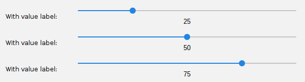
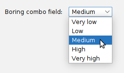
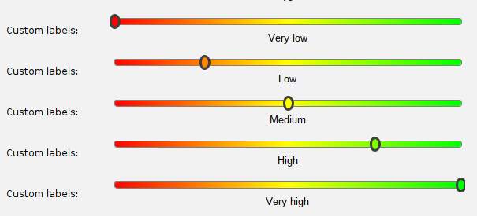
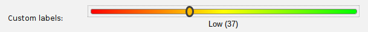

# Sliders

The default `JSlider` component included with Java Swing is fairly basic:


This allows the user to choose a numeric value on a scale from some minimum value to some maximum value. 
This is functional, but wouldn't it be nice if there were some customization options here?

## Introducing SliderField

The `SliderField` component in `swing-forms` wraps a JSlider and exposes some useful configuration
for making it more visually useful and interesting. You can of course generate a plain slider field
like the one pictured above, but there are some options here that are worth looking at in more detail.

### Adding a value label

The first thing we can do with `SliderField` is add an optional value label that will appear underneath
the slider as the user moves the grab bar:

```java
SliderField mySlider = new SliderField("With value label:", 0, 100, 25);
mySlider.setShowValueLabel(true); // Enables the display of the value label
```

This results in a numeric label that will show the current value of the slider. Here are three such sliders
with values of 25, 50, and 75, to show what this looks like:



### Adding a custom color gradient

Now let's ditch the boring standard UI and look at some ways of offering visual feedback to the user as the
grab bar is moved:

```java
SliderField mySlider = new SliderField("Custom colors:", 0, 100, 25);
mySlider.setColorStops(List.of(Color.BLACK, Color.BLUE, Color.CYAN, Color.WHITE));
mySlider.setShowValueLabel(true);
```

In the above code, we tell the slider to start with a black background on the left side of the slider,
moving through blue, then cyan, and ending with white on the right side of the slider. It looks like this:


We can add as many color stops as we like, and the gradient will be automatically computed and rendered
by the `SliderField` without any further code required. Notice that the grab bar also changes color as
you adjust its position on the track. 

### Custom non-numeric labels

The last thing we can do with `SliderField` to differentiate it from a regular JSlider is to add
custom, non-numeric labels to it. Suppose we want to offer the user a choice from a short list of
options representing a range of something. We could use a `ComboField` with the options laid
out as Strings:



But wouldn't it be nice if we could *visually* represent this range? Well, with `SliderField`, we can!

```java
SliderField mySlider = new SliderField("Custom labels:", 0, 100, 0);
mySlider.setColorStops(List.of(Color.RED, Color.YELLOW, Color.GREEN));
mySlider.setLabels(List.of("Very low", "Low", "Medium", "High", "Very high"), false);
```

This sets up a color gradient of red representing "very low" values, up to yellow representing "medium"
values, and then to green, representing "high" values:



This allows `SliderField` to serve as a more visually interesting substitute for a `ComboField` for
certain value selections! 

Note that the number of color stops does not have to match the number of custom labels! The `SliderField` class
is smart enough to interpolate as needed. In the example above, you'll note that we only supplied three
color stops, but five custom labels. This is not a problem. The `SliderField` will do the right thing.

### Showing both text and numeric labels together

You also have the option of showing both the custom text labels and also a numeric label representing
the actual behind-the-scenes numeric value, if you wish, by setting the last parameter to the `setLabels()`
method to true:

```java
// Let's see both our text labels and also the numeric label:
mySlider.setLabels(List.of("Very low", "Low", "Medium", "High", "Very high"), true);
```

That looks like this:


