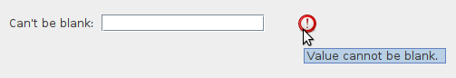
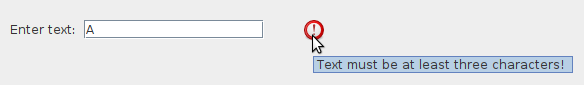
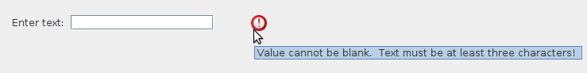
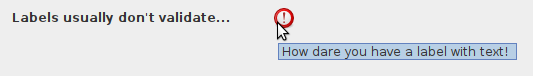

# Form validation

Form validation is optional, but is very easy to do with `swing-forms`. Often you want
to restrict certain fields so that they only allow certain values, or so that the
values in one field are only valid if some value in some other field is within a
certain range, etc. These rules are very easy to apply in swing-forms.

In the previous section, we saw a code example of one possible built-in
validation available with text fields, and that is the `setAllowBlank()` method. If you
tell the ShortTextField not to allow blank values, then it will automatically add
a FieldValidator with that rule to itself. But you are not limited to built-in
validation capabilities with these fields! You can add new validation rules
very easily. First, let's use the built-in validation rule to tell the ShortTextField
to not allow blank values:

```java
ShortTextField textField = new TextField("Can't be blank:", 15);
textField.setAllowBlank(false);
```

What happens now when we try to
validate the form with a blank value in that field?



We see that the field fails validation, and we get a helpful tooltip message
from the red validation marker. The ShortTextField itself added that FieldValidator
on our behalf because of the way we instantiated it.

But what if we want to add custom validation? This is quite easy!

```java
textField.addFieldValidator(new FieldValidator<ShortTextField>() {
    @Override
    public ValidationResult validate(ShortTextField fieldToValidate) {
        if (fieldToValidate.getText().length() < 3) {
            return ValidationResult.invalid("Text must be at least three characters!");
        }
        return ValidationResult.valid();
    }
});
```



Now we see our custom validation message is triggered if our own validation logic
determines that the field is invalid.

FormFields can have multiple FieldValidators attached to them. In this case, all
FieldValidators must report that the field is valid, otherwise the field will be
marked as invalid. If more than one FieldValidator reports a validation failure,
the validation messages will be concatenated together, like this:



Here we see both the built-in FieldValidator and our custom FieldValidator have both
reported a validation failure for the field in question. In this particular case,
the two messages are redundant. But, you can see how easy it is to apply multiple
validation rules to a FormField and have the FormPanel itself manage validating each
field and displaying messages as appropriate.

### Validating a form

FormPanel offers two equivalent methods for form validation:

- `isFormValid()` will validate the form and return a boolean indicating validation success.
- `validateForm()` will simply validate the form and return nothing.

Both of these methods will cause the validation success (green checkmark) or
failure (X marker) to appear beside each validatable field. Note that some
fields, like LabelField or CheckBoxField, do not subject themselves to
validation by default, as their contents are quite simple.

### Manually enabling or disabling validation on a field

All `FormField` implementations have a `hasValidationLabel()` method which (usually)
returns `true`. Some fields, for example `LabelField`, will return `false` from this
method unless one or more `FieldValidator`s have been added to it. This is because
labels do not allow user input, so it (usually) does not make sense to validate them.
Let's try overriding this default behavior by adding a `FieldValidator` to a `LabelField`:

```java
LabelField labelField = new LabelField("Labels usually don't validate...");
labelField.addFieldValidator(new FieldValidator<LabelField>(labelField) {
    @Override
    public ValidationResult validate(LabelField fieldToValidate) {
        if (!fieldToValidate.getText().isBlank()) {
            return ValidationResult.invalid("How dare you have a label with text!");
        }
        return ValidationResult.valid();
    }
});
```

When we validate the form, we see that the label has allowed itself to be validated:



Later, when we look at [custom FormField implementations](CustomFields.md), we can think
about whether it makes sense for our new custom field to respond to validation or not.
But for the built-in `FormField` implementations that come with `swing-forms`, the 
default behavior is usually what you want. You can override the default behavior
as shown above if you need to.
